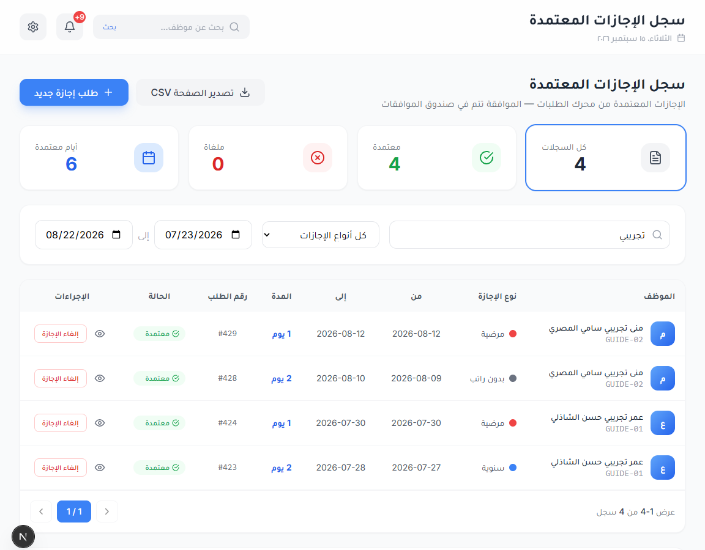
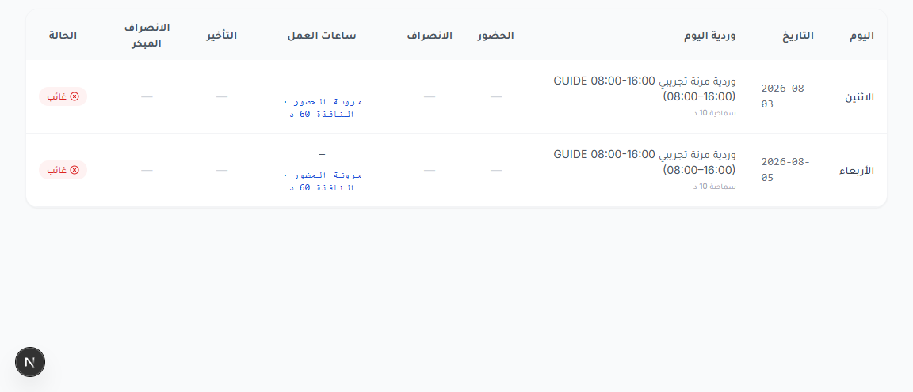
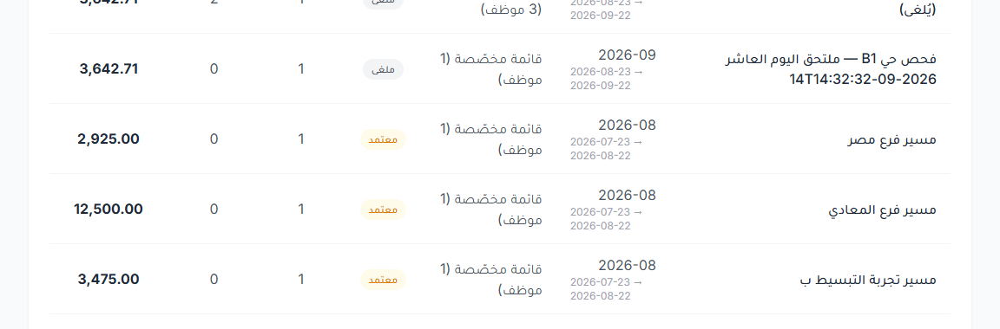

# دليل الموارد البشرية: من التهيئة لحد قسيمة المرتب — 15 سبتمبر 2026

الدليل ده لموظف الموارد البشرية، خطوة بخطوة. كل خطوة مكتوب فيها: **مين يعملها**، و**مكانها في القايمة**، و**إيه اللي يتملى**، و**إيه اللي يتضغط**، و**السيستم بيعمل إيه**، و**تتأكد إزاي**.

المثال اللي ماشيين بيه طول الدليل موظفين تجريبيين موجودين فعلًا في السيستم وتقدر تفتحهم:
- **GUIDE-01** «عمر تجريبي حسن الشاذلي»: اتعين من مارس، ومرتبه 9,000 + بدلات 3,000، وتبع «مسير فرع المعادي».
- **GUIDE-02** «منى تجريبي سامي المصري»: اتعينت 5 أغسطس، ومرتبها 6,000، وتبع «مسير فرع مصر».
- الفترة: **مسير شهر أغسطس 2026**، من 23 يوليو لـ 22 أغسطس.

---

## 0) قبل ما تبدأ

**الناس اللي في الدورة:**
| الدور | بيعمل إيه |
|---|---|
| مدير النظام | الإعدادات العامة والورديات، وبيعتمد المسيرات لو هو الشخص التاني |
| مسؤول الموارد البشرية | يضيف الموظفين، ويظبط الجدول والبصمات، ويدخل الطلبات بالنيابة، ويعمل المسير ويحسبه |
| المدير المباشر | يعتمد الإضافي بتاع فريقه، ويرفع خصم أو مكافأة لفريقه بس |
| الموظف | يطلب إجازة أو إذن أو سلفة من «طلباتي» أو «سلفي»، ويشوف قسيمته من «قسائم راتبي» |

**قواعد مهمة:**
1. **اللي يعمل حاجة مايعتمدهاش.** اللي حسب المسير مايعتمدوش، والسيستم بيمنع ده إلا لو اتفعلت «رخصة الشركة الصغيرة». واللي رفع خصم أو مكافأة مايعتمدوش، والسيستم بيمنع ده دايمًا (الرخصة مالهاش دعوة بالخصم والمكافأة). **لكن** الإجازة والإذن اللي بتدخلهم بالنيابة عن موظف بيظهروا عندك في «بانتظار موافقتي» وعليهم «اعتماد»، والسيستم مش هيمنعك، فسيبهم لشخص تاني.
2. **فترة المسير من يوم 23 لـ يوم 22** (من «يوم بداية دورة المسير»). يعني «مسير شهر أغسطس» = من 23 يوليو لـ 22 أغسطس.
3. **ماتحسبش المسير النهائي قبل ما الفترة تخلص.** الأيام اللي لسه ماجتش هتتحسب غياب.

---

## 1) التهيئة (مرة واحدة في الأول)

### 1.1 الفروع والأقسام والفرق والقوايم
- **مين:** مدير النظام، أو أي حد عنده صلاحية تنظيم الشركة.
- **فين:** «الإعدادات» ← «الفروع» / «الأقسام والإدارات» / «الفرق».
- **تدوس:** «إضافة فرع جديد» أو «إضافة قسم جديد» أو «إضافة فريق جديد»، تملى الاسم، وتدوس «إضافة الفرع» أو «إضافة القسم» أو «إضافة الفريق».
- **كمان:** «المسميات الوظيفية»، و«الدرجات الوظيفية»، و«مراكز التكلفة». القوايم دي هي نفسها اللي بتظهر في شاشة «إضافة موظف»، فأي مسمى أو درجة مش موجودة هنا مش هتلاقيها هناك.
- **تتأكد إزاي:** افتح «إضافة موظف» ← «البيانات الوظيفية» واتأكد إن الفرع والقسم والمسمى ظاهرين.

### 1.2 أيام العمل والعطلات
- **مين:** مدير النظام.
- **أيام الشغل والراحة:** «الإعدادات» ← «أيام العمل» ← «جداول العمل». اختار أيام الراحة في الجدول (عندنا الجمعة والسبت)، وبعدها هيظهر زرار «حفظ أيام العمل» فادوس عليه.
- **يوم استثنائي:** لو في يوم راحة بيتشغل (زي «آخر سبت في الشهر»)، ادوس «إضافة قاعدة» (بتفتح نافذة «إضافة قاعدة استثنائية»).
- **العطلات الرسمية:** «الإجازات» ← «العطلات الرسمية» ← «إضافة عطلة» (مثال: «ثورة 23 يوليو»).
- **تتأكد إزاي:** في «الجدول الأسبوعي» يوم العطلة بيظهر «إجازة»، واليوم الاستثنائي بيظهر «دوام استثنائي».

### 1.3 الورديات
- **مين:** **مدير النظام**. مسؤول الموارد البشرية بتاع الفرع هيملى الفورم كله وفي الآخر هيترفض برسالة «تعريف الدوام مشترك بين الفروع».
- **فين:** «الحضور والانصراف» ← «الورديات» ← «إضافة وردية جديدة».
- **تملى:** الاسم، وبداية ونهاية الدوام، ونوعها (ثابتة أو مرنة)، ولو مرنة: مدة نافذة المرونة (مثلًا ساعة) والساعات المطلوبة (مثلًا 480 دقيقة = 8 ساعات).
- **تدوس:** «إضافة الوردية».

**المرونة بتشتغل إزاي (مثال وردية 08:00-16:00 بمرونة ساعة):**
| الموظف وصل | النتيجة |
|---|---|
| من 08:00 لـ 09:00 (مثلًا 08:40) | **مش متأخر**، بس لازم يكمل 8 ساعات من وقت وصوله، يعني يمشي 16:40 |
| بعد 09:00 (مثلًا 09:15) | **متأخر 75 دقيقة**، لأن التأخير بيتحسب من 08:00 مش من 09:00، والـ75 بتدخل شرائح المعادلة |
| مشي بدري | الدقايق الناقصة بعد ما التأخير يتشال: لو أكتر من 10 دقايق بتتخصم كلها |
| قعد بعد الدوام | الإضافي بيبدأ بعد آخر الوقتين: نهاية الوردية، أو وقت الوصول + 8 ساعات |

> خلي بالك: شاشة «سجل الحضور» بتكتب «بعد سماح 10 د» حتى في الوردية المرنة، مع إن السماحية مابتتطبقش فيها. الرقم نفسه صح.

*الورديات: مرنتين بنافذة ساعة، وليلية 20:00-01:00*

### 1.4 أجهزة البصمة
- **مين:** مدير النظام.
- **فين:** «الحضور والانصراف» ← «أجهزة البصمة» ← «تسجيل جهاز جديد». البصمات بتتسحب لوحدها كل 5 دقايق، ولو عايز تسحب دلوقتي ادوس «سحب الآن» جنب الجهاز أو «سحب الكل الآن».
- **مهم:** «رقم البصمة» في ملف الموظف لازم يكون **نفس رقم الموظف على الجهاز**، وإلا بصماته مش هتتربط بيه.
- **لازم البصمات توصل في أقل من 30 يوم.** الإضافي بتاع يوم عدى عليه أكتر من 30 يوم مش بيروح للاعتماد.
- **مفتاح الجهاز سري.** ماتكتبوش في أي مكان ولا تبعته لحد.

### 1.5 أنواع الإجازات
- **فين:** «الإجازات» ← «أنواع الإجازات» ← «إضافة نوع».
- **الموجود عندنا:**
  - «سنوية»: مدفوعة، 21 يوم في السنة.
  - «مرضية»: مدفوعة، 180 يوم، ومحتاجة «تقرير طبي».
  - «بدون راتب»: من غير رصيد، وبتتخصم يوم بيوم.
- **تتأكد إزاي:** افتح «رصيد الإجازات» ودور على الموظف.

*أنواع الإجازات: سنوية ومرضية مدفوعتين برصيد، وبدون راتب من غير رصيد*

### 1.6 أنواع الأذونات
- **فين:** «الإعدادات» ← «أنواع الأذونات» ← «إضافة نوع إذن».
- **الموجود عندنا:** «اذن صباحي» و«اذن مسائي». أقصى إذن 120 دقيقة، ومجاني **مرتين و240 دقيقة في الشهر**، وبعد كده بيتخصم 100%.
- **خلي بالك:** الشهر هنا يعني الشهر الميلادي (من أول الشهر لآخره)، مش فترة المسير (من 23 لـ 22).

*أنواع الأذونات: «اذن صباحي» و«اذن مسائي» 120 دقيقة، ومجانيين مرتين و240 دقيقة في الشهر*

### 1.7 إعدادات الرواتب والسلف العامة
- **مين:** مدير النظام.
- **فين:** «الإعدادات» ← «سياسات الإجازات والأوفرتايم». الرسايل جوه السيستم بتسميها «سياسات النظام»، وده نفس المكان.
- **تظبط:**
  - «يوم بداية دورة المسير» (عندنا 23). **ماتغيروش في نص الشغل.**
  - «طلب السلفة من يوم / إلى يوم»: الأيام اللي الموظف يقدر يطلب فيها سلفة. عندنا من 1 لـ 31.
  - «رخصة الشركة الصغيرة»: فعلها **بس** لو مفيش شخص تاني يعتمد المسير.

*«يوم بداية دورة المسير» = 23*

*«طلب السلفة من يوم 1 إلى يوم 31»*

### 1.8 إعدادات الإضافي
- **فين:** «الإعدادات» ← «أيام العمل» ← قسم «العمل الإضافي (الأوفرتايم)». فيه «الاكتشاف التلقائي خارج الفترات المحددة» (عندنا «مفعّل»)، و«الحد الأدنى للاحتساب (ساعات)» = 0.5، و«وحدة التقريب للأسفل (دقيقة)» = 15، و«حد تقديم الطلب بأثر رجعي (يوم)» = 30، وبعد التعديل تدوس «حفظ».
- **سعر الإضافي** (× 1.5 في يوم العمل والراحة، و× 2 في العطلة) إعداد عام للشركة، ومش ظاهر في الصفحة دي ولا في غيرها.
- **فتح أو قفل تواريخ معينة:** في نفس الصفحة ← «فترات فتح/قفل الأوفرتايم بالتواريخ» ← «إضافة فترة». بتملى «اسم الفترة» و«من تاريخ» و«إلى تاريخ»، وتختار «التأثير» («مفتوح — يُحتسب الأوفرتايم» أو «مقفول — لا يُحتسب») و«الفرع»، وتدوس «إضافة الفترة».
- **مهم:** طول ما الكشف العام شغال، **الفترة المفتوحة مابتفرقش في حاجة**. اللي بيمنع الإضافي فعلًا هو فترة **مقفولة**.

*إعدادات العمل الإضافي في «أيام العمل»*

### 1.9 سقف السلف
- **مين:** الموارد البشرية.
- **فين:** «الرواتب» ← «السلف والقروض» ← «سياسات السقوف» ← «سياسة جديدة».
- **تملى** (نافذة «سياسة سقوف جديدة»): «الاسم»، و«النطاق» (فروع أو «موظفون محددون») و«عناصر النطاق»، و«نسبة من الراتب %» و«قاعدة النسبة»، و«سقف مقطوع للطلب»، و«يسري من».
- **خلي بالك:** **لو مفيش سياسة على الموظف، مفيش سقف خالص.**
- **المثال:** «سقف سلف تجريبي GUIDE»: 10% من الإجمالي، والحد 1000. GUIDE-02 مرتبها 6,000، فسقفها 600.

*سياسة سقف جديدة: 10% من الإجمالي والحد 1000*

### 1.10 أنواع الخصومات والمكافآت
- **فين:** «الرواتب» ← «الخصومات» ← تبويب «أنواع الخصومات»، و«المكافآت» ← تبويب «أنواع المكافآت».
- **الموجود:**
  - خصومات: «خصم إداري»، «خصم التزام»، «خصم إنتاجية»، «خصم جودة».
  - مكافآت: «مكافأة أداء»، «مكافأة مشروع»، «مكافأة فورية».
- كل نوع مكتوب فيه مين يرفعه ومين يعتمده.

*أنواع الخصومات: مين يرفع ومين يعتمد*

---

## 2) إدخال موظف جديد

- **مين:** مسؤول الموارد البشرية.
- **فين:** «إدارة الموظفين» ← «إضافة موظف». الشاشة فيها 5 خطوات، وبتتنقل بينهم بـ«التالي».

### الخطوة 1: البيانات الشخصية
| الخانة | معناها | مثال GUIDE-01 |
|---|---|---|
| رفع صورة | صورة الموظف اللي بتظهر في ملفه | صورة |
| الاسم الأول / اسم الأب / اسم الجد / اسم العائلة (عربي) | الاسم الأول **إجباري**، والباقي بيتجمع في «الاسم الكامل (تلقائي)» | عمر / تجريبي / حسن / الشاذلي |
| First Name / Middle Name / Last Name | الاسم بالإنجليزي | Omar / Guide / Elshazly |
| تاريخ الميلاد، مكان الميلاد، الجنس، الحالة الاجتماعية، الجنسية | بيانات شخصية | |
| رقم الهوية / الإقامة | من 10 لـ 14 رقم، وماينفعش يتكرر | رقم تجريبي |
| رقم جواز السفر، تاريخ انتهاء الجواز | | |
| رقم الجوال، رقم جوال بديل | | |
| البريد الإلكتروني الشخصي | بريد الموظف الشخصي (مختلف عن بريد الشغل) | |
| البلد، المدينة، الحي، الرمز البريدي | العنوان | مصر، القاهرة، المعادي، 11728 |
| جهة اتصال للطوارئ: الاسم، صلة القرابة، رقم الجوال، رقم بديل | حد نكلمه وقت الطوارئ | زوج/زوجة |

*«إضافة موظف» ← البيانات الشخصية لـ GUIDE-01*

### الخطوة 2: البيانات الوظيفية
| الخانة | معناها | مثال GUIDE-01 |
|---|---|---|
| الرقم الوظيفي | حروف إنجليزي وأرقام وشرطة. لو سبته فاضي بياخد «رقم البصمة» | GUIDE-01 |
| رقم البصمة | **نفس رقم الموظف على جهاز البصمة** | 90101 |
| تاريخ التعيين | **إجباري**. المرتب بيبدأ منه، إلا لو كتبت «تاريخ بداية العمل الفعلي» | 2026-03-01 |
| تاريخ بداية العمل الفعلي | لو بدأ شغل في يوم غير يوم التعيين. **لو اتكتب، المسير بيحسب المرتب من اليوم ده** | 2026-03-01 |
| نوع التوظيف، حالة الموظف، تاريخ انتهاء فترة التجربة، مصدر التوظيف | | نشط، التجربة لحد 2026-05-29 |
| الفرع | **إجباري** | الفرع الرئيسي |
| الإدارة/القسم، الفريق | | الموارد البشرية، «الحضور» |
| المسمى الوظيفي، الدرجة الوظيفية | من قوايم الإعدادات | أخصائي موارد بشرية، الدرجة الثانية |
| المدير المباشر | **مهم:** هو اللي بيعتمد الإضافي، وهو اللي يقدر يرفع خصم أو مكافأة على الموظف. الملاحظة «يتحدد تلقائياً» اللي تحته مابتعملش حاجة، فاختاره بإيدك | أحمد محمود الشريف |
| موقع العمل، مركز التكلفة | | |
| معلومات العقد: نوع العقد، رقم العقد، تاريخ بداية/نهاية العقد، مدة العقد (أشهر)، فترة الإشعار (أيام)، مرفق العقد | | محدد المدة، GUIDE-01-C-2026، 12 شهر، 30 يوم |
| جدول العمل (البطاقات) | أيام الشغل والراحة الأساسية. لو اخترت «بدون جدول (يتبع الفرع)» بياخد أيام الفرع | «الجدول الأساسي» |
| المرونة لهذا الموظف | خليها «يتبع إعداد الوردية أو جدول العمل» إلا لو عايز تغيرها للموظف ده بس | يتبع إعداد الوردية |
| يسري الفرع أو الدوام أو المرونة من، سبب التغيير | من امتى الكلام ده يبدأ. **خليه تاريخ التعيين** | 2026-03-01 |
| يستحق إجازات سنوية | «يستحق ✓» أو «لا يستحق» | يستحق |
| الرصيد الافتتاحي (يوم)، صلاحية الرصيد الافتتاحي، تاريخ انتهاء الرصيد | أيام إجازة جاية معاه من قبل. لو اخترت «حتى تاريخ أحدده» لازم تكتب التاريخ | 3 أيام لحد 2026-12-31 |
| البريد الإلكتروني للعمل | بريد الشغل | |

*البيانات الوظيفية: الرقم الوظيفي ورقم البصمة والتعيين والفرع والفريق والمدير المباشر والعقد*

*جدول العمل والمرونة من تاريخ التعيين، واستحقاق السنوية والرصيد الافتتاحي*

### الخطوة 3: البيانات المالية
| الخانة | معناها | مثال GUIDE-01 |
|---|---|---|
| الراتب الأساسي | | 8,000 |
| العملة، طريقة الدفع، دورة الراتب | | ريال سعودي، تحويل بنكي، شهري |
| البدلات الثابتة: بدل السكن، بدل المواصلات، بدل الهاتف، بدل طبيعة العمل، بدلات أخرى | **الأساسي + البدلات = إجمالي المرتب** اللي بيتحسب منه سعر اليوم والساعة | سكن 2,000، مواصلات 1,000 |
| يسري من راتب شهر | **مهم جدًا:** السيستم بيحط فيها الشهر الحالي لوحده. **غيرها لشهر التعيين**، وإلا الشهور اللي قبله تفضل من غير مرتب مسجل | 2026-03 |
| اسم البنك، اسم الفرع، رقم الحساب (IBAN) | | |
| رقم التأمينات (GOSI)، خاضع للتأمينات، الراتب الخاضع للتأمينات | بتتسجل في الملف، ومش بتدخل في حساب المسير دلوقتي | نعم، 8,000 |

*البيانات المالية: الأساسي والبدلات و«يسري من راتب شهر» 2026-03*

### الخطوة 4: المؤهلات والخبرات
- تملى صف المؤهل (أو الشهادة، أو الخبرة، أو المهارة، أو اللغة) وتدوس «+ إضافة مؤهل» (أو «+ إضافة شهادة»، وهكذا).
- لو نسيت تدوس «+ إضافة»، السيستم بيضيف الصف لوحده وقت الحفظ. ولو الصف ناقص، هيوقفك ويقولك «أضف الصف أو امسحه».

*المؤهلات والخبرات بعد «+ إضافة»*

### الخطوة 5: المستندات
- ارفع: صورة الهوية / الإقامة، وصورة جواز السفر، وشهادة المؤهل، والسيرة الذاتية، وشهادات الخبرة، وصورة شخصية رسمية.
- وبعدين ادوس **«حفظ وإضافة الموظف»**.
- «حفظ مسودة الجلسة» بتحفظ على جهازك انت بس، **مش** في السيستم.

*المستندات قبل «حفظ وإضافة الموظف»*

**السيستم بيعمل إيه:** بيعمل الموظف، ويسجل مرتبه من الشهر اللي اخترته، ويعمله رصيد السنوية والمرضية، ويربطه بالجدول والفرع.

**تتأكد إزاي:** افتح ملف الموظف من «قائمة الموظفين» ولف على التبويبات:
- «البيانات الوظيفية»: فيها الفريق ومركز التكلفة وجدول العمل بساعاته، و«سجل الدوام».
- «البيانات المالية»: فيها المرتب والإجمالي.
- «الإجازات»: فيها «يستحق إجازة سنوية: نعم — 21 يوم/سنة».
- «المستندات»: فيها كل الملفات اللي رفعتها.

*ملف الموظف ← «البيانات الوظيفية»*

**مثال GUIDE-02 (اتعينت في نص الفترة):** تاريخ التعيين 2026-08-05، والمرتب 6,000 من غير بدلات، و«يسري من راتب شهر» 2026-08، والمدير المباشر «مدير النظام».

*GUIDE-02: من غير فريق، والمدير المباشر «مدير النظام»*

### 2.1 زيادة المرتب
- **مين:** الموارد البشرية، وتكون عندك صلاحية اعتماد الرواتب.
- **فين:** ملف الموظف ← «تعديل» ← «البيانات المالية».
- **تملى:** المبلغ الجديد (مثلًا الأساسي 9,000). هيظهرلك «موعد تطبيق تعديل الراتب»، املى فيه:
  - «يسري من راتب شهر»: مثلًا 2026-08.
  - «سبب التغيير».
  - «مرجع العقد أو القرار».
- **تدوس:** «التالي» لحد الآخر، وبعدين «حفظ التغييرات».
- **السيستم بيعمل إيه:** الزيادة بتسري **من أول الشهر ده كله**. مسير أغسطس (من 23 يوليو لـ 22 أغسطس) اتحسب كله على 9,000.
- **تتأكد إزاي:**
  - «السجل الوظيفي» في الملف: هتلاقي «تغيير راتب 8,000 → 9,000».
  - «سجل الأجر»: افتح `/payroll/salary-history` واكتبه في المتصفح بنفسك لأن **مالوش لينك في القايمة**، واختار الموظف وادوس «عرض سجل الأجر».
- **الشهر الجاي:** شاشة التعديل بتقبل الشهر الحالي أو شهر فات بس. لو الزيادة تبدأ الشهر الجاي، اعملها «طلب زيادة راتب».

*الأساسي 9000 و«يسري من راتب شهر» 2026-08 مع السبب والمرجع*

*سجل الأجر: 8000 من مارس لحد يوليو، و9000 من أغسطس*

---

## 3) الوردية والبصمة

### 3.1 توزيع الورديات على الأسابيع
- **مين:** الموارد البشرية.
- **فين:** «الحضور والانصراف» ← «الجدول الأسبوعي».
- **تعمل:**
  1. روح للأسبوع اللي عايزه.
  2. دور على الموظف في خانة البحث **اللي فوق الجدول**.
  3. ادوس على خانة في صفه ← «اختر وردية الأسبوع» ← اختار الوردية.
  4. ادوس «حفظ الجدول».
- **يوم مختلف:** لو يوم واحد بس ليه وردية تانية (زي وردية ليلية)، قف على الخانة وادوس النجمة الصغيرة «وردية يوم خاص»، اختار الوردية وادوس «حفظ». ولو غلطت ادوس «إرجاع لوردية الأسبوع».
- **خلي بالك:**
  - التوزيع **أسبوع بأسبوع**، يعني الفترة الواحدة محتاجة حوالي 5 مرات حفظ.
  - الجدول بيخبي من الأربع للسبت، فحرك يمين وشمال علشان تشوفهم.
- **تتأكد إزاي:** الخانة بيظهر فيها اسم الوردية، واليوم المختلف مكتوب عليه «يوم خاص».

*أسبوع 9 أغسطس: GUIDE-01 على المرنة 08:00-16:00، وGUIDE-02 على المرنة 09:00-17:00*

*«وردية يوم خاص» لـ GUIDE-02 يوم 13 أغسطس على الوردية الليلية*

### 3.2 البصمة ومتابعة الحضور كل يوم
- **البصمة بتيجي لوحدها من الجهاز**، واليوم بيتحسب أول ما البصمة توصل.
- **فين تتابع:** «الحضور والانصراف» ← «سجل الحضور»، واختار التاريخ.
- **الحالات:**
  - «حاضر».
  - «متأخر».
  - «في إجازة».
  - «بصمة ناقصة»: بصمة دخول من غير انصراف.
  - «غائب».
  - «عطلة».
- **الوردية الليلية:** بصمة 01:02 بعد نص الليل بتتحسب على اليوم اللي قبلها، ومكتوب جنبها «صباح اليوم التالي».

*10 أغسطس: GUIDE-01 وصل 09:15، يعني متأخر 75 دقيقة*

*13 أغسطس: GUIDE-02 من 19:56 لـ 01:02 «صباح اليوم التالي»*

### 3.3 موظف نسي يبصم
- **مين:** الموارد البشرية.
- **فين:** «الحضور والانصراف» ← «الإدخال اليدوي» ← «إدخال جديد».
- **تملى:** الموظف، والتاريخ، ووقت الحضور **ووقت الانصراف** (الشاشة بتطلب الاتنين حتى لو الناقص واحد بس)، والسبب.
- **تدوس:** «حفظ الإدخال».
- **السيستم بيعمل إيه:** بيحسب اليوم تاني على طول، وتظهرلك رسالة «أُعيد حساب 1 يوم حضور».
- **تتأكد إزاي:** في «سجل الحضور» اليوم بقى «حاضر» وجنبه «يدوي».

> **مهم:** البصمة الناقصة **مش بتوقف حساب المسير ومش بيطلع عليها تنبيه**. اعتماد المسير بس هو اللي بيترفض برسالة «حضور الموظف #233 يحتاج مراجعة». علشان كده **دور على «بصمة ناقصة» قبل ما تحسب المسير.**

*11 أغسطس: GUIDE-01 بصم دخول 07:58 ومابصمش انصراف*

*«الإدخال اليدوي»: حضور 07:58 وانصراف 16:00 مع السبب*

*بعد التصليح: «حاضر» 8 ساعات*

### 3.4 الكشف الشهري
- **فين:** «الحضور والانصراف» ← «الكشف الشهري» ← اختار الموظف والشهر.
- **خلي بالك:**
  - الكشف **بالشهر الميلادي**، فمسير أغسطس محتاج كشف يوليو وكشف أغسطس.
  - **الغياب القديم (أكتر من 31 يوم) مش بيظهر هنا** لحد ما المسير يتحسب. ملخص GUIDE-02 كان بيقول «غياب 0» مع إنها غابت يوم 11.
  - **ماتدوسش «إعادة حساب اليوم»** في «سجل الحضور» علشان موظف واحد، لأنها بتحسب اليوم للفرع كله.

*الكشف الشهري لـ GUIDE-02: من 5 أغسطس بس، وفيه الإذن والليلية والتأخير*

---

## 4) الإجازات والأذونات والاعتمادات

### 4.1 تقديم الطلب
- **مين:** الموظف بنفسه من «طلباتي» ← «طلب جديد». ولو الموظف ملوش حساب أو الطلب قديم، الموارد البشرية تقدمه **بالنيابة عنه**.
- **الموارد البشرية بالنيابة:**
  1. «طلباتي» ← «طلب جديد».
  2. علّم على **«تقديم نيابة عن موظف آخر»** واختار الموظف.
  3. من «الإجازات» اختار «طلب إجازة»، أو من «الحضور والوقت» اختار «استئذان».
  4. املى: للإجازة (النوع، من تاريخ، إلى تاريخ، ونطاق اليوم «يوم كامل»)، وللإذن (النوع، التاريخ، من، إلى).
  5. في «مرضية» ارفع **«تقرير طبي»**، من غيره الطلب مش هيتبعت.
  6. اكتب «تفاصيل الطلب» وادوس «إرسال الطلب».
- **السيستم بيعمل إيه:** بيعد «عدد الأيام» لوحده (أيام العمل بس)، ويبعت الطلب للموارد البشرية.
- **خلي بالك:**
  - الإجازة اللي عدى عليها أكتر من 30 يوم مايدخلهاش غير الموارد البشرية.
  - الطلبات اللي قدمتها بالنيابة **مش هتظهر في «طلباتي» عندك**. تابعها من «لوحة الطلبات (HR)».

*«تقديم نيابة عن موظف آخر» ← GUIDE-01 ← سنوية يومين*

*مرضية ومعاها «تقرير طبي»*

*«اذن صباحي» من 08:00 لـ 10:00*

### 4.2 الاعتماد
- **مين:** الموارد البشرية (للإجازات والأذونات). **يفضل يكون شخص غير اللي دخل الطلب**، حتى لو السيستم سايبك تعتمده.
- **فين:** «بانتظار موافقتي».
- **تدوس:** «اعتماد» ← اكتب ملاحظة ← «تأكيد اعتماد».
- **السيستم بيعمل إيه:** الإجازة بتتسجل وتتخصم من الرصيد (المرحّل الأول)، واليوم في الحضور بيبقى «في إجازة». الإذن بيغطي دقايقه لما البصمات تيجي.
- **تتأكد إزاي:**
  - «لوحة الطلبات (HR)»: الحالة «مكتمل».
  - «رصيد الإجازات»: الرصيد نقص.
  - «سجل الإجازات المعتمدة»: الإجازة ظاهرة.
- **لو الإذن اتعتمد قبل البصمة:** اليوم هيظهر «غائب» لحد ما البصمة تيجي. ده طبيعي.

*«بانتظار موافقتي»: كروت الإجازات والأذونات وعليها «اعتماد» و«رفض»*

*بعد الاعتماد: GUIDE-01 سنوية فاضله 11.5 ومرضية 179*

*«سجل الإجازات المعتمدة» للفترة*

*قبل ما البصمات تيجي: يوما الإذن 3 و5 أغسطس ظاهرين «غائب»، وبيتظبطوا لوحدهم أول ما البصمة توصل*

### 4.3 الإضافي
- **مين بيعمله:** السيستم لوحده. أول ما الموظف يبصم بعد مواعيده بنص ساعة أو أكتر، بيعمل طلب «عمل إضافي مكتشف (بصمة)».
- **مين بيعتمده:** **المدير المباشر** من «بانتظار موافقتي»، مش الموارد البشرية.
- **فين تتابع:** «الحضور والانصراف» ← «العمل الإضافي»، اختار الشهر. الحالات بتمشي كده: «مُقدّم للاعتماد» ← «معتمد — بانتظار المسير».
- **لو عايز تقفل الإضافي في أيام معينة:** «أيام العمل» ← «إضافة فترة» ← «التأثير» = «مقفول — لا يُحتسب».
- **تتأكد إزاي:** في المثال، GUIDE-01 اشتغل يوم 20 أغسطس لحد 18:03 واليوم كان مقفول، **ومفيش ولا سطر إضافي**.

*«إضافة فترة»: «فتح إضافي تجريبي GUIDE» من 16 لـ 19 أغسطس*

*«قفل إضافي تجريبي GUIDE» يوم 20 أغسطس*

*المدير المباشر بيشوف كروت «عمل إضافي مكتشف (بصمة)»*

*«معتمد — بانتظار المسير»: 3 × 150 لـ GUIDE-01 و75 لـ GUIDE-02*

---

## 5) طلبات الخصم والمكافأة والسلف

### 5.1 خصم أو مكافأة من المدير
- **مين:** المدير المباشر أو قائد الفريق أو مدير القسم، **لفريقه بس** (وفي المكافأة كمان مدير الفرع).
- **فين:** «خصوماتي» ← «إنشاء خصم»، أو «مكافآتي» ← «اقتراح مكافأة».
- **تملى:**
  - النوع (مثلًا «خصم إداري»).
  - المبلغ.
  - **«شهر المسير المستهدف»** (مثلًا 2026-08).
  - «تاريخ الواقعة» (في الخصم).
  - الموظف من «الموظفون المشمولون» (في المكافأة اسمها «المستفيدون»).
  - «سبب الخصم» أو «سبب المكافأة» (20 حرف على الأقل).
- **تدوس:** «معاينة الأرقام» ← «إرسال للاعتماد».
- **السيستم بيعمل إيه:** لو الموظف مش في فريقه، مش هيلاقيه في البحث («لا يوجد موظفون في نطاقك بهذه الفلاتر»).

*المدير: خصم إداري 100 على GUIDE-01*

*المدير بيدور على GUIDE-02 ومش لاقيها لأنها مش في فريقه*

### 5.2 خصم أو مكافأة من الموارد البشرية لمجموعة
- **فين:** «الرواتب» ← «الخصومات» ← «إنشاء خصم» ← «موظف أو مجموعة مختارة» (أو «المكافآت»).
- **تملى:** نفس الخانات، وتختار الموظفين.
- **خلي بالك:** «الإجمالي» في المعاينة ده مجموع الناس كلها. يعني 100 = 50 لكل واحد من الاتنين.

*خصم إداري 50 لـ GUIDE-01 وGUIDE-02*

### 5.3 اعتماد الخصم والمكافأة
- **مين:** الموارد البشرية، **وتكون مش انت اللي رفعت الطلب**.
- **فين:** «بانتظار موافقتي» هيقولك «خصومات ومكافآت بانتظار موافقتك» وهيوديك للصفحة. الاعتماد نفسه بيتعمل من «الخصومات» أو «المكافآت».
- **تدوس:** «اعتماد» ← ملاحظة ← «تأكيد».
- **السيستم بيعمل إيه:** الطلب بيتحول لبند مستني في مسير الشهر اللي اخترته، وبيظهر في المسير لما تحسب أو تعيد الحساب.

*نافذة «اعتماد الخصم»*

### 5.4 السلف
- **الموظف:** من «سلفي» ← «طلب سلفة». لو المبلغ فوق السقف أو اليوم برا الأيام المسموحة، زرار «إرسال للاعتماد» بيتقفل.
- **الموارد البشرية بالنيابة:** «طلباتي» ← «طلب جديد» ← علّم «تقديم نيابة عن موظف آخر» ← الموظف ← تبويب «المالية» ← «سلفة» ← املى «المبلغ» و«عدد الأشهر» ← «إرسال الطلب».
  - **خلي بالك:** الشاشة دي **مش بتعرض السقف قبل ما تبعت**. لو المبلغ فوقه هتعرف بعد ما تدوس.
  - **ماتستخدمش «طلب سلفة جديد»** في «السلف والقروض» علشان تطلب لموظف، لأنها بتعمل السلفة باسمك انت.
- **الاعتماد:** الموارد البشرية (شخص تاني) من «بانتظار موافقتي» ← «اعتماد» ← «تأكيد اعتماد».
- **الأقساط:** **أول قسط بيبدأ الشهر اللي بعد الاعتماد**، وده مش مكتوب في الطلب. تشوفه في «السلف والقروض» لما تفتح اسم الموظف.
- **المثال:**
  - GUIDE-02 طلبت 900 واترفضت: «المبلغ المطلوب 900.00 يتجاوز السقف الفعّال 600.00».
  - طلبت 450 على 3 شهور واتقبلت: 3 أقساط 150 في أكتوبر ونوفمبر وديسمبر.

*900 فوق السقف 600 فاترفضت*

*سلفة 450 بتلات أقساط 150 من أكتوبر*

---

## 6) معادلات الرواتب

المعادلة هي اللي بتحدد **التأخير بيتخصم إزاي، والخروج بدري، ونقص الساعات، والغياب**. كل مسير بيشتغل بمعادلة واحدة.

- **مين:** الموارد البشرية.
- **فين:** «الرواتب» ← «معادلات الرواتب». العنوان اللي فوق الصفحة هيقول «سياسات الرواتب»، وده نفس المكان.
- **تعمل:**
  1. «معادلات جديدة» ← اكتب الاسم (مثلًا «معادلات رواتب فرع المعادي») ← «حفظ» ← «حفظ وتفعيل».
  2. في قسم «طريقة الخصم» اختار:
     - **«خصم التأخير» و«شرائح التأخير»:** بتختار جدول شرائح جاهز، زي «الشرائح الأصلية» (1-60 دقيقة = ربع يوم، و61-120 = نص يوم).
     - **«خصم الخروج المبكر (الوردية الثابتة)»:** يتخصم أو لأ.
     - **«خصم نقص ساعات العمل» و«طريقة خصم النقص»:** «بالدقيقة»، أو «بالدقيقة × مضاعف» وتكتب المضاعف (مثلًا 1.5).
     - **«معامل الغياب بلا إذن (أيام)»:** 1 يعني يوم الغياب بيوم، و2 يعني يوم الغياب بيومين.
  3. ادوس «حفظ طريقة الخصم».
- **أي خانة تسيبها فاضية** («زي الإعدادات العامة») بتاخد القيمة العامة.
- **جداول الشرائح:** من زرار «القيم العامة وجداول شرائح التأخير» ← قسم «مجموعة جديدة»: ضيف الشرائح بزرار «شريحة»، وبعدين «معاينة وتحقق» ← «حفظ المجموعة».
  - **خلي بالك:** الجدول بيتحفظ على شهر، **وأي جدول بتحفظه على شهر حقيقي بيحل محل شرائح الشركة كلها في الشهر ده.**
  - لو عايز جدول لمعادلة واحدة بس، اسأل مدير النظام الأول.
- **سعر الإضافي** مش في المعادلة، ده عام للشركة.
- **تتأكد إزاي:** افتح المعادلة تاني وشوف «طريقة الخصم».

**المعادلتين في المثال:**
| | «معادلات رواتب فرع المعادي» | «معادلات رواتب فرع مصر» |
|---|---|---|
| التأخير | 1-60 دقيقة = ربع يوم، 61-120 = نص يوم | 1-60 دقيقة = نص يوم، 61 فأكتر = يوم |
| نقص الساعات | × 1 | × 1.5 |
| الغياب | يوم × 1 | يوم × 2 |

*«طريقة الخصم» في «معادلات رواتب فرع المعادي»*

*«طريقة الخصم» في «معادلات رواتب فرع مصر»*

---

## 7) المسير بالاسم وإضافة الموظفين

- **مين:** الموارد البشرية.
- **فين:** «الرواتب» ← «مسير الرواتب» ← «مسير جديد».
- **تملى:**
  - **«اسم المسير (فريد داخل الشهر)»:** مثلًا «مسير فرع المعادي».
  - **«معادلات الرواتب»:** مثلًا «معادلات رواتب فرع المعادي».
  - **«شهر الراتب»:** 2026-08.
  - **الموظفين:** اختار تبويب «قائمة موظفين محددة»، ودور في «الموظفون» واختارهم.
- **تدوس:** «معاينة العضوية». هتشوف لكل موظف «التغطية» و«الأيام» و«راتب الشهر» و«المستحق قبل البنود». **اتأكد إن الموظف الجديد أيامه صح.** GUIDE-02 طلعت من 2026-08-05 لـ 2026-08-22، يعني 18 يوم، والمستحق 3,600.
- **وبعدين:** «حفظ كمسودة» ← **«احتساب المسودة»**.
- **السيستم بيعمل إيه:** بيجيب المرتب من سجل الأجر، والحضور يوم بيوم، والإجازات، والإضافي المعتمد، والخصومات والمكافآت المعتمدة لشهر المسير، ويحسب الصافي.
- **مسير لكل مجموعة:** كل مجموعة ليها مسير باسمها. «مسير فرع مصر» اتعمل بنفس الطريقة بـ«معادلات رواتب فرع مصر» وGUIDE-02.

*«مسير جديد»: الاسم والمعادلة والشهر والموظف، ومعاينة 31 يوم و12,000*

*«مسير فرع مصر»: GUIDE-02 من 2026-08-05، 18 يوم، والمستحق 3,600*

---

## 8) المراجعة: شيل خصم أو زود مكافأة

### 8.1 راجع صف كل موظف
- **الأعمدة:** «الأساسي»، «البدلات»، «العمل الإضافي» (وساعاته)، «إضافات أخرى»، «الإجمالي»، «خصم التأخير» (ودقايقه)، «نقص ساعات العمل»، «خصم الغياب» (وأيامه)، «إجازة بدون راتب» (وأيامها)، «أقساط السلف»، «خصومات أخرى»، «إجمالي الخصم»، «الصافي».
- **قبل الاعتماد اتأكد من 3 حاجات:**
  1. مفيش موظف عنده «بصمة ناقصة» في الفترة. **المسير مش هيقولك.**
  2. كل الإجازات والأذونات والإضافي والخصومات اتعتمدت.
  3. الموظف اللي اتعين جديد أيامه صح.

*صف GUIDE-01: أساسي 9,000، وبدلات 3,000، وإضافي 450، وإضافات 200، وتأخير 200 (75 دقيقة)*

### 8.2 شيل خصم عن موظف
- **مين:** الموارد البشرية.
- **فين:** جوه المسير قبل الاعتماد، في صف الموظف تحت عمود «عرض» ← **«إلغاء خصم»**.
- **تدوس:** اختار الخصم (مثلًا «خصم التأخير — 200.00») ← «إلغاء هذا الخصم».
- **السيستم بيعمل إيه:** بيحسب المسير تاني لوحده، وفي القسيمة بيكتب سطر «أُلغي خصم التأخير بمبلغ 200.00 ر.س».
- **خلي بالك:** مفيش خانة سبب ولا رسالة تأكيد. **اتأكد قبل ما تدوس.**
- **تتأكد إزاي:** عمود التأخير بقى 0، والصافي زاد.

*بعد إلغاء خصم التأخير: الخصومات 150 والصافي 12,500*

### 8.3 مكافأة لموظف من جوه المسير
- **فين:** جوه المسير قبل الاعتماد، في صف الموظف تحت عمود «عرض» ← **«مكافأة»**. هتفتح «اقتراح مكافأة» واسم الموظف و«شهر المسير المستهدف» متعبيين. النوع بيبدأ على «مكافأة أداء»، فغيره لو محتاج.
- **تملى:** النوع (مثلًا «مكافأة فورية»)، والمبلغ (300)، والسبب.
- **تدوس:** «معاينة الأرقام» ← «إرسال للاعتماد».
- **بعد كده:** شخص تاني يعتمدها من «المكافآت»، وانت ترجع المسير وتدوس **«إعادة حساب المسير»**.
- **تتأكد إزاي:** عمود الإضافات زاد 300، والصافي بقى 2,925.

*«مكافأة» من صف GUIDE-02: الموظفة والشهر متعبيين*

*بعد «إعادة حساب المسير»: الصافي 2,925*

---

## 9) الاعتماد والقسايم

### 9.1 الاعتماد
- **مين:** **شخص غير اللي حسب المسير** (عندنا مدير النظام).
- **فين:** «مسير الرواتب» ← اختار المسير ← **«اعتماد المسير»**.
- **لو اترفض برسالة «حضور الموظف #... يحتاج مراجعة»:**
  1. روح «سجل الحضور» ودور على «بصمة ناقصة» للموظف ده.
  2. صلحها من «الإدخال اليدوي».
  3. ارجع المسير وادوس «إعادة حساب المسير».
  4. اعتمد تاني.
- **بعد الاعتماد:** ادوس «صرف المسير». «قناة الصرف» بتبدأ على «مختلط حسب طريقة صرف كل موظف»، و«مرجع الصرف» على اسم المسير والشهر، وتقدر تغيرهم. في التجربة دي **اعتمدنا بس ومصرفناش**.
- **تتأكد إزاي:** المسير مكتوب عليه «معتمد» واسم اللي حسب واللي اعتمد. وفي «تقرير الرواتب» ← «المسيرات» هتلاقي الصافي.

*الاعتماد اترفض لأن يوم 11 أغسطس كان ناقصه بصمة انصراف*

*«مسير فرع المعادي» معتمد والصافي 12,500*

*«تقرير الرواتب» ← «المسيرات»*

### 9.2 القسايم
- **الموارد البشرية:** من جدول المسير، أيقونة العين في عمود «عرض» بتفتح قسيمة الموظف (وأيقونة الطابعة للطباعة).
- **الموظف:** من «قسائم راتبي».
- **خلي بالك:** القسيمة دلوقتي بتعرض «رقم الهوية» و«البنك» و«رقم الحساب البنكي الدولي» بشرطة «—». ده عيب معروف، والبيانات موجودة في ملف الموظف.

*قسيمة GUIDE-01: الخصومات بأسبابها، و«أُلغي خصم التأخير بمبلغ 200.00 ر.س»، والصافي 12,500*

*قسيمة GUIDE-02: التأخير يوم × 200، والإضافي 75، والمكافأة 300، والصافي 2,925*

---

## 10) الشهر الجديد

- **مين:** الموارد البشرية.
- **فين:** افتح مسير الشهر اللي فات ← **«مسير الشهر التالي»**.
- **السيستم بيعمل إيه:** بيجهزلك نفس الاسم، ونفس المعادلة، ونفس الموظفين، للشهر اللي بعده (مثلًا 2026-09 = من 23 أغسطس لـ 22 سبتمبر).
- **تدوس:** «معاينة العضوية» ← «حفظ كمسودة».
- **لو فيه موظف جديد:** ضيفه قبل «معاينة العضوية».
- **الحساب:** **ماتحسبش غير بعد يوم 22.** وقبل ما تحسب، اعمل «مراجعة آخر الشهر» اللي في التقويم تحت.

*«مسير الشهر التالي»: نفس الاسم والمعادلة والموظف لشهر 2026-09*

*مسودة سبتمبر محفوظة ولسه ماتحسبتش*

---

## 11) المثال كامل بالأرقام

### GUIDE-01 في «مسير فرع المعادي»
- المرتب 9,000 + 2,000 + 1,000 = **12,000**. سعر اليوم 12,000 ÷ 30 = **400**، والساعة 400 ÷ 8 = **50**.

| اللي حصل | الحساب | المبلغ |
|---|---|---|
| إجازة سنوية يومين + مرضية يوم | مدفوعة | 0 |
| إذن صباحي يوم 3/8 ووصل 09:57 | الإذن غطى | 0 |
| إذن مسائي يوم 5/8 ومشي 14:01 | الإذن غطى | 0 |
| وصل 08:40 يوم 6/8 | جوه المرونة | 0 |
| وصل 09:15 يوم 10/8 | 75 دقيقة = نص يوم × 400 | −200 (**واتلغى** من جوه المسير ← 0) |
| نسي يبصم انصراف 11/8 | اتصلح يدوي 16:00 | 0 |
| إضافي 17 و18 و19/8 | 3 × ساعتين × 50 × 1.5 | +450 |
| اشتغل لحد 18:03 يوم 20/8 | اليوم مقفول | 0 |
| خصم المدير | خصم إداري | −100 |
| خصم جماعي | خصم إداري | −50 |
| مكافأة المدير | مكافأة فورية | +200 |
| **الصافي** | 12,000 + 450 + 200 − 150 | **12,500** |

### GUIDE-02 في «مسير فرع مصر»
- المرتب 6,000، واتعينت 5/8، يعني 18 يوم: 6,000 ÷ 30 × 18 = **3,600**. سعر اليوم **200**، والساعة **25**.

| اللي حصل | الحساب | المبلغ |
|---|---|---|
| من 23/7 لـ 4/8 | قبل التعيين، اتشالت مش اتخصمت | — |
| إذن صباحي 6/8 وإذن مسائي 16/8 | الإذن غطى | 0 |
| بدون راتب 9 و10/8 | 2 × 200 | −400 |
| غياب 11/8 | يوم × 200 × معامل 2 | −400 |
| مرضية 12/8 | مدفوعة | 0 |
| وردية ليلية 13/8 | حاضرة | 0 |
| وصلت 10:20 يوم 17/8 | 80 دقيقة = يوم × 200 | −200 |
| إضافي 18/8 | ساعتين × 25 × 1.5 | +75 |
| خصم جماعي | خصم إداري | −50 |
| مكافأة من جوه المسير | مكافأة فورية | +300 |
| **الصافي** | 3,600 + 75 + 300 − 1,050 | **2,925** |

---

## 12) تقويم الشهر لمسؤول الموارد البشرية (الفترة من 23 لـ 22)

| امتى | تعمل إيه | فين |
|---|---|---|
| **يوم 23** (أول الفترة) | اعمل «مسير الشهر التالي» لكل مسير واحفظه مسودة، وضيف الموظفين الجداد | «مسير الرواتب» |
| **أول كل أسبوع** | وزع ورديات الأسبوع، و«وردية يوم خاص» للأيام المختلفة | «الجدول الأسبوعي» |
| **كل يوم** | دور على «بصمة ناقصة» و«غائب» وصلحهم: «الإدخال اليدوي»، أو إذن أو إجازة بالنيابة | «سجل الحضور»، «الإدخال اليدوي» |
| **كل يوم أو يومين** | اعتمد الإجازات والأذونات والخصومات والمكافآت والسلف، وفكّر المديرين يعتمدوا الإضافي | «بانتظار موافقتي»، «الخصومات»، «المكافآت» |
| **وقت ما تحتاج** | افتح أو اقفل الإضافي لأيام معينة | «أيام العمل» ← «إضافة فترة» |
| **في أيام طلب السلفة** | تابع طلبات السلف | «بانتظار موافقتي»، «السلف والقروض» |
| **قبل يوم 22 بأسبوع** | فكّر المديرين يرفعوا الخصومات والمكافآت **بشهر المسير الصح** | «خصوماتي» و«مكافآتي» عندهم |
| **يوم 22** | آخر يوم في الفترة. **ماتحسبش قبله** | — |
| **من 23 لـ 25** | راجع «الكشف الشهري» (كشفين: الشهر اللي فات والشهر ده). صلح كل «بصمة ناقصة». اتأكد مفيش طلبات مستنية. وبعدين «احتساب المسودة» أو «إعادة حساب المسير» | «الكشف الشهري»، «مسير الرواتب» |
| **من 25 لـ 26** | راجع صفوف الموظفين، و«إلغاء خصم» أو «مكافأة» لو محتاج، وبعدها «إعادة حساب المسير» | «مسير الرواتب» |
| **من 26 لـ 27** | الشخص التاني يعتمد، وبعدين «صرف المسير». الموظفين بيشوفوا قسايمهم من «قسائم راتبي» | «مسير الرواتب»، «تقرير الرواتب» |

> **مهم:** لو البصمات بتتسحب من الجهاز متأخر، لازم توصل في أقل من **30 يوم**، وإلا الإضافي بتاعها مش هيتحسب.

---

## 13) أسئلة شائعة

**الموظف اتعين في نص الفترة، هياخد كام؟**
بياخد الأيام من يوم تعيينه لآخر الفترة بس: المرتب ÷ 30 × عدد الأيام. الأيام اللي قبل التعيين مش بتتحسب غياب. مثال GUIDE-02: 6,000 ÷ 30 × 18 = 3,600.

**الزيادة بتبدأ امتى؟**
من أول الشهر اللي بتكتبه في «يسري من راتب شهر»، وبتتطبق على الفترة كلها.

**الموظف وصل متأخر 40 دقيقة ومفيش خصم، ليه؟**
لو ورديته مرنة بساعة، أي وصول جوه الساعة مش تأخير، بس لازم يكمل 8 ساعات. التأخير بيبدأ بعد الساعة، وبيتحسب من أول الدوام.

**الموظف معاه إذن صباحي ووصل 10:00، هيتخصم؟**
لأ. الإذن بيغطي دقايقه طول ما هو في الحد المجاني (مرتين و240 دقيقة في الشهر).

**نسي يبصم انصراف، أعمل إيه؟**
«الإدخال اليدوي» ← «إدخال جديد»، واكتب الحضور والانصراف والسبب. من غير كده المسير هيتحسب عادي، بس الاعتماد هيترفض.

**الموظف غاب يوم ومش ظاهر في الكشف الشهري؟**
لو اليوم فات عليه أكتر من 31 يوم، الغياب مش هيظهر لحد ما المسير يتحسب، بس هيتخصم صح. تقدر تتأكد من صف الموظف في المسير.

**إجازة بدون راتب من الخميس للأحد، هتتخصم كام؟**
**خلي بالك:** الطلب بيعد أيام العمل بس، لكن المسير دلوقتي بيخصم كل الأيام من أول تاريخ لآخر تاريخ، ومنها الجمعة والسبت. لحد ما ده يتصلح، **قسم الإجازة**: طلب قبل الويك إند وطلب بعده (ده اقتراح مننا من قراءة الكود، وماجربناهوش).

**الموظف اشتغل بعد مواعيده ومفيش إضافي، ليه؟**
واحدة من دول:
- الزيادة أقل من نص ساعة.
- اليوم جوه فترة «مقفول».
- المدير المباشر لسه مااعتمدش.
- البصمة وصلت بعد أكتر من 30 يوم.

**المدير مش لاقي الموظف علشان يرفع عليه خصم؟**
الموظف مش في فريقه، ولا هو مديره المباشر، ولا مدير قسمه. خلي الموارد البشرية ترفعه.

**مش قادر أعتمد المسير؟**
- لو انت اللي حسبته، لازم شخص تاني يعتمد.
- لو الرسالة «حضور الموظف #... يحتاج مراجعة»، صلح البصمة الناقصة وادوس «إعادة حساب المسير».

**عايز أشيل خصم التأخير عن موظف واحد بس؟**
جوه المسير ← «إلغاء خصم» جنب الموظف ← اختار الخصم ← «إلغاء هذا الخصم».

**عدلت المعادلة، المسير هيتغير لوحده؟**
لأ. ادوس «إعادة حساب المسير» في المسير اللي لسه مااتعتمدش.

**طلب السلفة اترفض؟**
- لو الرسالة فيها «يتجاوز السقف الفعّال»، يبقى المبلغ فوق سقف الموظف.
- لو «طلب السلفة متاح من يوم … إلى يوم …»، يبقى النهارده برا الأيام المسموحة.

**أول قسط السلفة امتى؟**
الشهر اللي بعد الاعتماد. تشوفه في «السلف والقروض» لما تفتح اسم الموظف.

**قدمت طلبات بالنيابة ومش لاقيها في «طلباتي»؟**
دي بتظهر في «لوحة الطلبات (HR)».

**فين سجل مرتبات الموظف القديمة؟**
في `/payroll/salary-history`، اكتبها في المتصفح بنفسك لأن مالهاش لينك في القايمة. أو في «السجل الوظيفي» في ملف الموظف.

**ينفع أحسب مسير الشهر قبل يوم 22؟**
تقدر تشوف أرقام تقريبية، بس **ماتعتمدش**. الأيام اللي لسه ماجتش هتتحسب غياب.

**فيه كلام غريب على الكروت زي «[object Object]» أو «ANNUAL»؟**
ده عرض بس ومش بيأثر على الحساب. «ANNUAL» يعني سنوية، و«SICK» يعني مرضية.
