# تبسيط الرواتب — 15 سبتمبر 2026

الرواتب رجعت للي انت طلبته: معادلات بالاسم، مسيرات بالاسم بتتكرر كل شهر، إلغاء خصم ومكافأة من جوه المسير، طلبات، سلف، وإعدادات.
أي حاجة زيادة **اتخفت من الشاشة بس**. مفيش بيانات ولا جداول اتمسحت.

## 1) اللي اتخفى
- **القايمة الجانبية:** «الإعفاءات المالية»، «قسائم الراتب»، «البدلات»، «التأمينات»، و«إعفاءاتي» عند الموظف. اللينك القديم بيوديك لـ«مسير الرواتب» (أو «قسائم راتبي»). مجموعة الرواتب فيها 6 بس: مسير الرواتب، معادلات الرواتب، المكافآت، الخصومات، السلف والقروض، تقرير الرواتب.
- **شاشة المسير:** محرك الحساب، لقطة السياسة، سجل المسير، العكس والتكميلي، موظفون بلا مسير، «شهري / فترة مخصصة»، الفلاتر المتقدمة، الكارت المكرر تحت، ومركز التكلفة.
- **معادلات الرواتب:** ترتيب التحصيل، فحص المصادر، الكود، النسخ والبصمة، والخانات اللي مالهاش أثر في الحساب.
- **المكافآت والخصومات والسلف:** الجداول القديمة، تبويب «التقارير»، السلفة الاستثنائية، السداد المبكر (وكمان من «طلب جديد»)، تأجيل القسط، و«أرصدة بعد الإنهاء».
- **التقرير والقسيمة:** تبويب «المسيرات» بس، من غير مسيرات العكس والتكميلي، والقسيمة من غير إنجليزي ولا QR.
- **الطلبات العامة:** «مكافأة/حافز» و«اعتراض على خصم» القديمين اتقفلوا، والطلبات القديمة فاضلة.

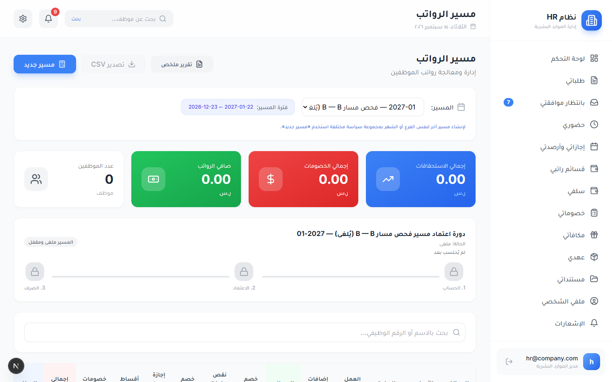

## 2) اللي اتبسّط
- «مسير جديد» فيه الاسم والمعادلة والشهر والموظفين والمستبعدين وبس.
- إعادة الحساب من غير سبب مكتوب، وبتاخد آخر تعديل في المعادلة.
- الاعتماد مابقاش مستني إقرار ولا أسباب فروق، ولسه بيمنع الصافي بالسالب.
- الموظف اللي بياناته ناقصة مابيوقفش الحساب، بيظهر في «المستبعدون» ومعاه السبب.
- لو موظف في مسير تاني لنفس الأيام بيظهر سطر واحد وزرار «استبعاد».
- في الصرف القناة والمرجع متعبيين جاهزين.
- أنواع المكافآت والخصومات وسقوف السلف: الأساسي ظاهر، والباقي تحت «خيارات إضافية».
- الأكواد والأرقام الداخلية على الشاشات بقت كلام عربي.

**إعدادات اتغيرت، وتقدر ترجّعها من «سياسات النظام»:** مصدر المرتب بقى «سجل الأجر أو راتب الملف». اعتراض الموظف على خصم مابيوقفش الموافقة. إلغاء الخصم بقى من غير موافقة تانية ولا حد سنوي ولا انتظار ولا مرفق. ومدير القسم مابقاش يلغي خصومات.

## 3) النواقص اللي اتقفلت
1. كل معادلة بتحدد خصم التأخير وشرائحه، والخروج بدري، ونقص الساعات، ومعامل الغياب، والخانة الفاضية بتاخد القيمة العامة.
2. زرار «مسير الشهر التالي».
3. زرار «إلغاء خصم» جنب كل موظف، والمسير بيتحسب تاني لوحده.
4. زرار «مكافأة» بيفتح طلب جاهز باسم الموظف وشهر المسير.
5. «بانتظار موافقتي» بيبيّن عدد الخصومات والمكافآت اللي مستنياك.
6. أيام طلب السلفة (من يوم كذا لـيوم كذا) بتتظبط من «سياسات النظام»، والأصل من 1 لـ 31.

واتصلح كمان وقت التجربة: استثناء الحضور يقدر يبدأ من أول الفترة اللي فاتت طول ما مسيرها ماتعتمدش، ومكافأة المدير بتمشي في سلسلة موافقات نوعها من غير خطوة زيادة لمدير القسم، وتغيير نوع المكافأة مابيمسحش الموظف والشهر.

## 4) إزاي تشتغل
1. **اعمل معادلة:** من «معادلات الرواتب» اعمل مجموعة باسم زي «معادلات رواتب فرع المعادي» ودوس «حفظ» وبعدها «حفظ وتفعيل». في «طريقة الخصم» اختار التأخير وشرائحه والخروج بدري ونقص الساعات ومعامل الغياب، وأي خانة تسيبها فاضية بتاخد القيمة العامة.
    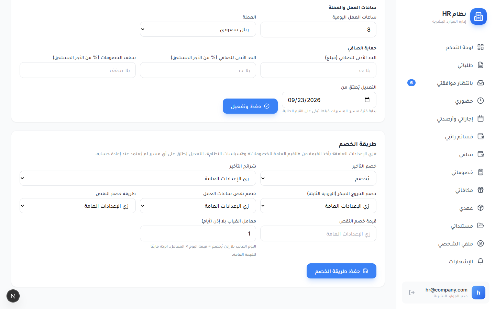 
2. **اعمل المسير:** من «مسير الرواتب» دوس «مسير جديد» واكتب الاسم واختار المعادلة والشهر والموظفين، وبعدها احفظ واحسب. هيظهرلك كل موظف بمرتبه وخصوماته ومكافآته وصافيه.
    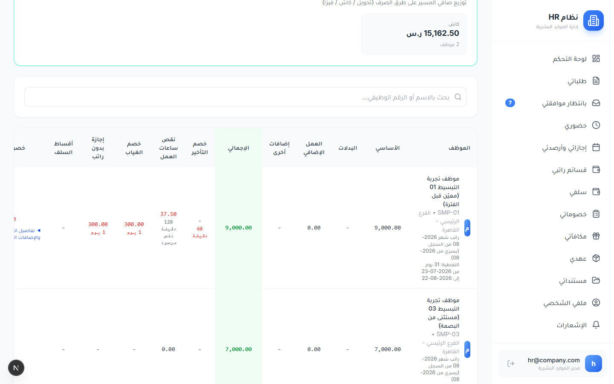
3. **الحضور بيتحسب لوحده:** الغياب من غير إذن بيتخصم، والإجازة من غير مرتب بتتخصم يوم بيوم، والإذن الصباحي أو المسائي بيغطي ساعاته، والمستثنى من البصمة (من شاشة «استثناء الحضور») بياخد مرتبه كامل. اللي اتعين في نص الفترة بياخد أيامه بس، والزيادة بتسري من أول الشهر.
4. **شيل خصم:** دوس «إلغاء خصم» جنب الموظف واختار الخصم، والمسير هيتحسب تاني لوحده.
    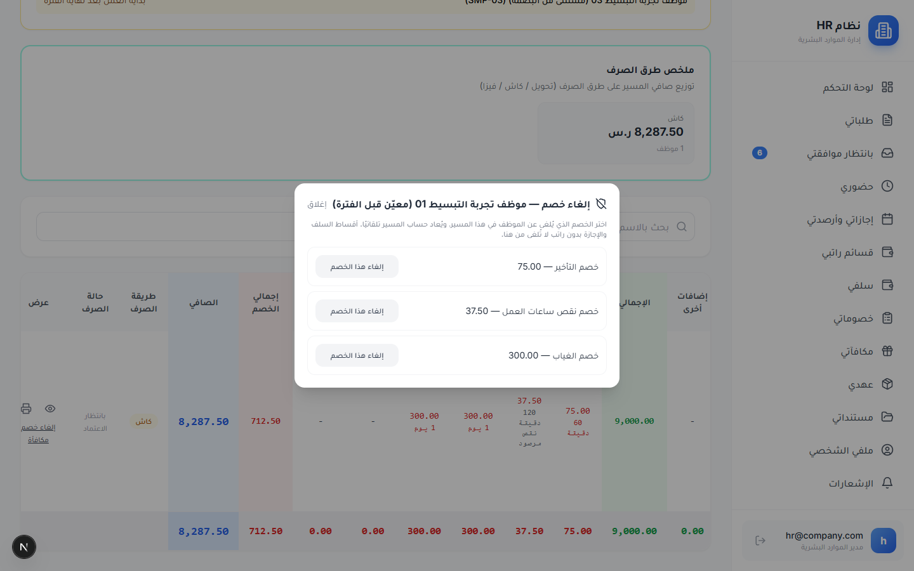
5. **خصم أو مكافأة كطلب:** المدير يرفع لفريقه بس، والموارد البشرية ترفع لموظف أو لمجموعة، من «الخصومات» أو «المكافآت» أو من زرار «مكافأة» في المسير. الطلب بيمشي في الموافقات العادية وعدده بيظهر في «بانتظار موافقتي»، وبعد الموافقة بينزل في مسير شهره لما تعيد الحساب.
    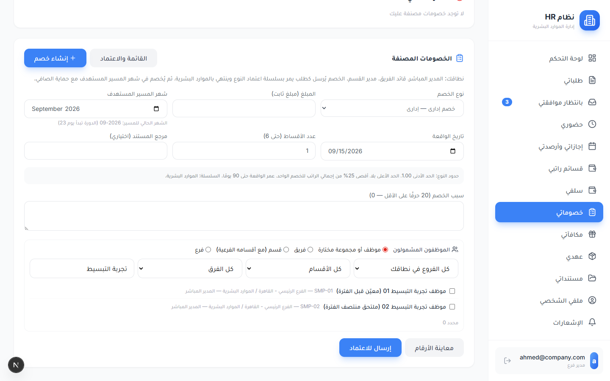 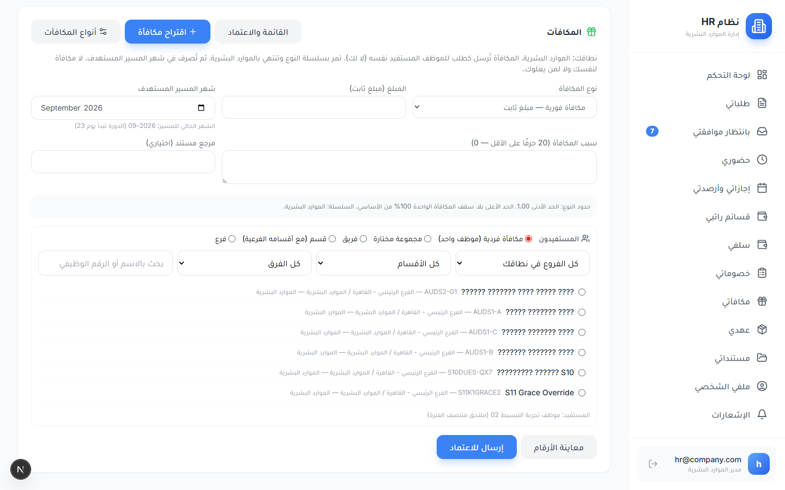 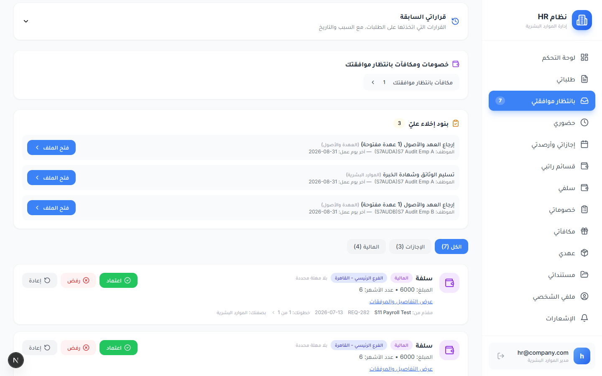
6. **اعتمد واصرف:** اللي حسب المسير مايعتمدوش، إلا لو فعّلت «رخصة الشركة الصغيرة». بعد الاعتماد دوس «صرف المسير»، والقناة والمرجع جاهزين.
    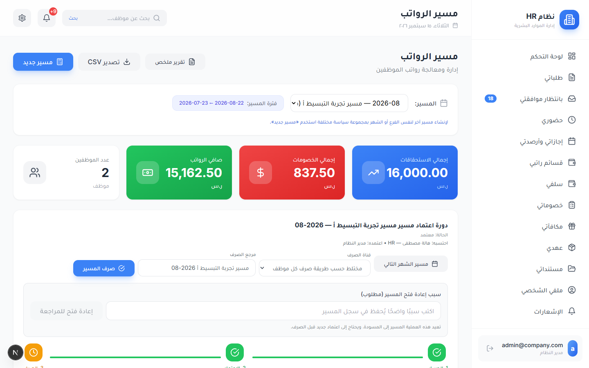
7. **القسيمة والشهر الجاي:** قسيمة كل موظف بتتفتح من جدول المسير، والخصم اللي اتلغى بيظهر فيها سطر واحد زي «أُلغي خصم التأخير بمبلغ 75.00». وللشهر الجاي دوس «مسير الشهر التالي»، هيطلعلك نفس الاسم والمعادلة والموظفين والمستبعدين.
    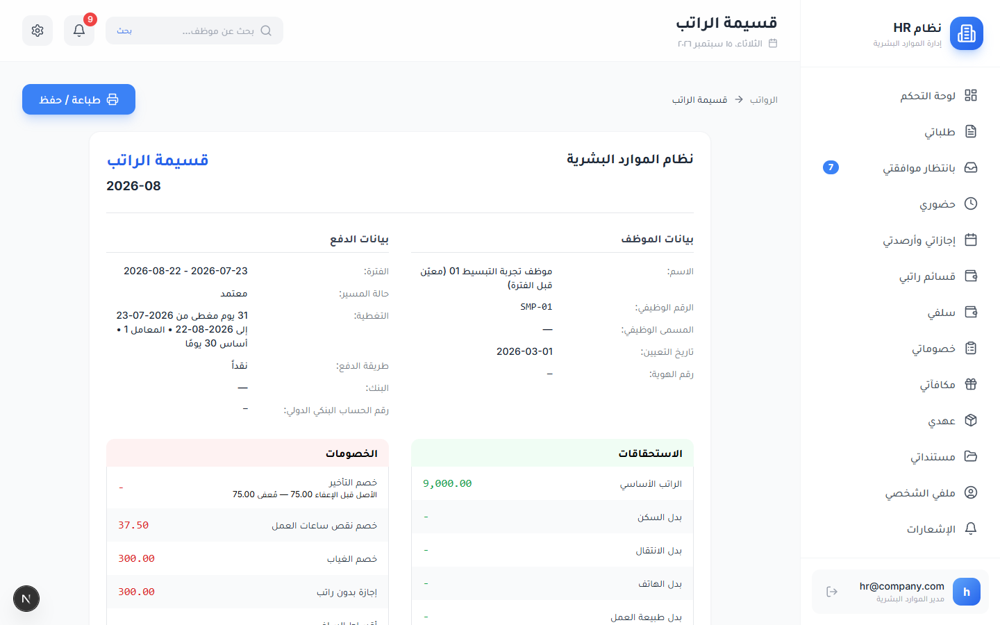 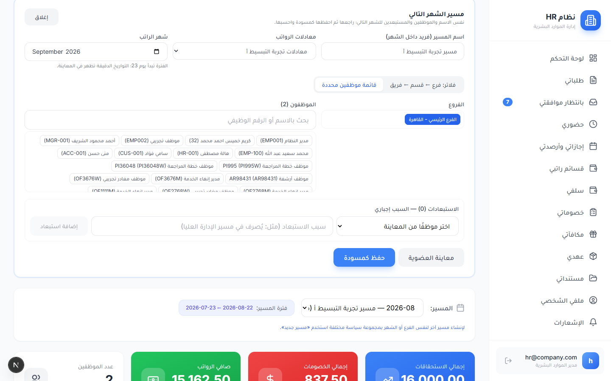
8. **السلف:** السقف بيتظبط من «السلف والقروض» ← «سياسات» (نسبة من المرتب أو مبلغ ثابت)، والأيام من «سياسات النظام» ← «طلب السلفة من يوم / إلى يوم». الموظف بيطلب من «سلفي»، ولو طلب فوق السقف أو في يوم برا الأيام زرار الإرسال بيتقفل وتظهر رسالة بالعربي.
    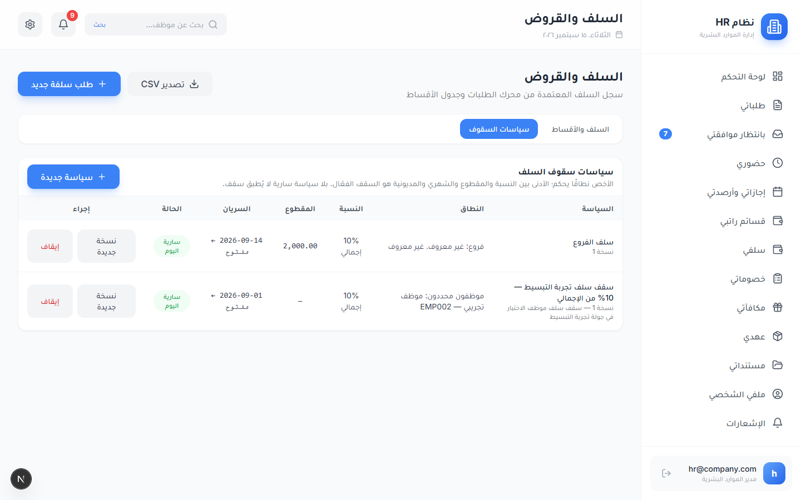 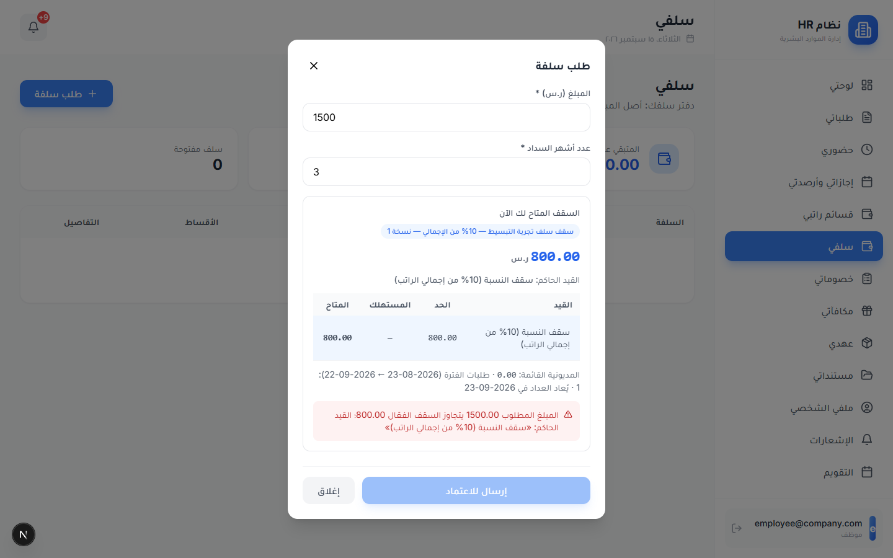 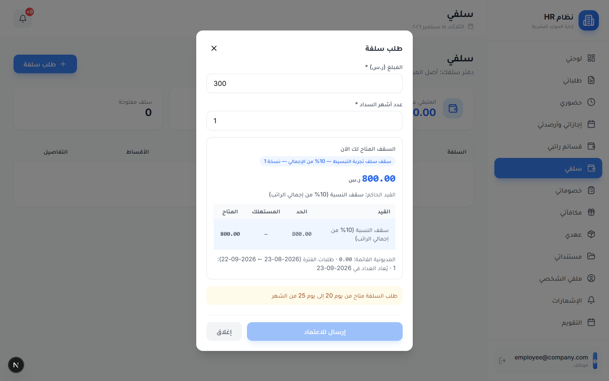

## 5) أرقام التجربة: مسيرات أغسطس 2026 (من 23 يوليو لـ 22 أغسطس)
| المسير | الموظف | المرتب | الخصومات | الإضافات | الصافي |
|---|---|---|---|---|---|
| 67 «مسير تجربة التبسيط أ» (معادلة أ) | SMP-01 (متعيّن من مارس، زيادته من 8,000 لـ 9,000 بدأت في أغسطس) | 9,000 | 837.50 | 0 | **8,162.50** |
| 67 | SMP-03 (مستثنى من البصمة) | 7,000 | 0 | 0 | **7,000** |
| 68 «مسير تجربة التبسيط ب» (معادلة ب) | SMP-02 (اتعيّن 6 أغسطس، مرتبه 6,000) | 3,400 | 475 | 550 | **3,475** |

- **SMP-01، يوم 3/8، تأخير ساعة:** 75 (ربع يوم × 300)، واتلغى بـ«إلغاء خصم» فبقى 0.
- **SMP-01، يوم 4/8، خروج بدري ساعة:** 37.50 نقص ساعات (يوم بـ 300 ÷ 8 ساعات).
- **SMP-01، يوم 5/8، غياب من غير إذن:** 300 (يوم × معامل 1).
- **SMP-01، يوم 18/8، إجازة من غير مرتب:** 300 عن اليوم.
- **SMP-01، يوم 19/8، إذن صباحي ساعتين ووصل الساعة 10:** مفيش خصم.
- **SMP-01:** 150 خصم رفعه مديره، و50 خصم جماعي من الموارد البشرية.
- **SMP-02، الأيام اللي قبل تعيينه (من 23/7 لـ 5/8):** اتشالت ومااتخصمتش. 6,000 ÷ 30 × 17 يوم = 3,400.
- **SMP-02، يوم 10/8، تأخير ساعة:** خصم التأخير 0 لأن معادلة ب قافلاه، بس الساعة اتحسبت نقص ساعات بـ 25.
- **SMP-02، يوم 11/8، غياب:** 400 (يوم × معامل 2 × 200).
- **SMP-02:** 50 خصم جماعي، ومكافأتين بـ 250 و300.
- **SMP-03:** مفيش ولا بصمة، ولأنه مستثنى أخد الـ 7,000 كاملين.

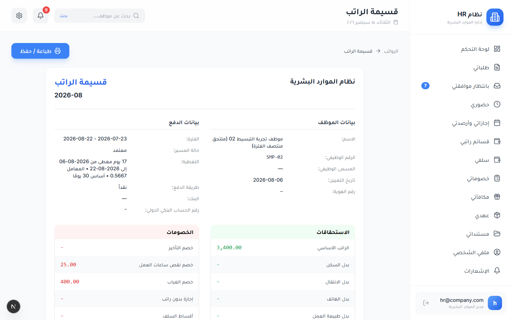 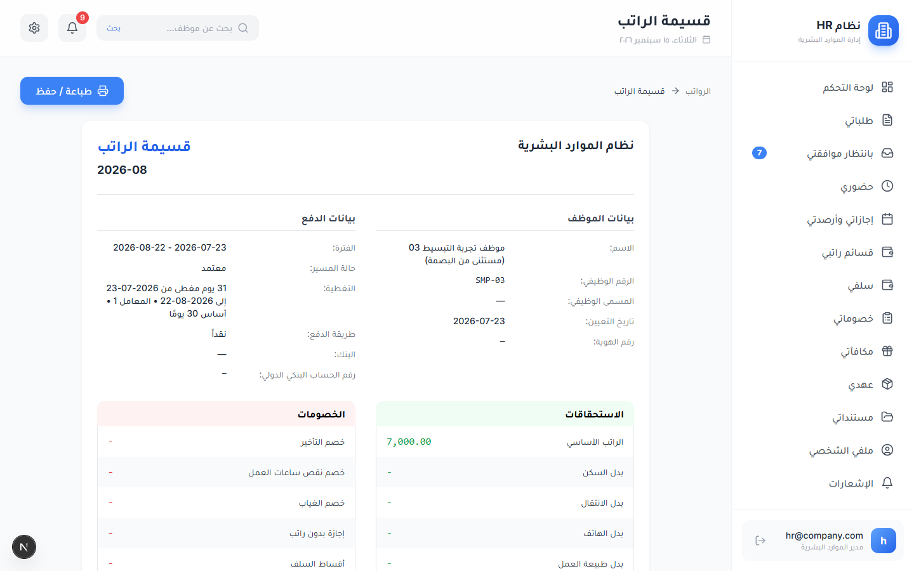

مسيرات سبتمبر (69 و70) اتعملت بـ«مسير الشهر التالي» ولسه محسوبة ومااتعتمدتش: SMP-01 صافيه 8,700، وSMP-03 صافيه 7,000، وSMP-02 صافيه 6,000 (فيها مكافأة المدير 400، وغياب يوم 15/9 لأن الفترة لسه ماخلصتش).

## 6) حاجات لسه مش مظبوطة
- **محتاجة إيدك:** لو مفيش حد تاني بيعتمد المسيرات، فعّل «رخصة الشركة الصغيرة» من «سياسات النظام». ماغيّرناهاش لأنها صلاحية أمان.
- في «طلباتي»، كارت طلب السلفة مكتوب عليه «cap check: [object Object]». نافذة التفاصيل نفسها سليمة.

  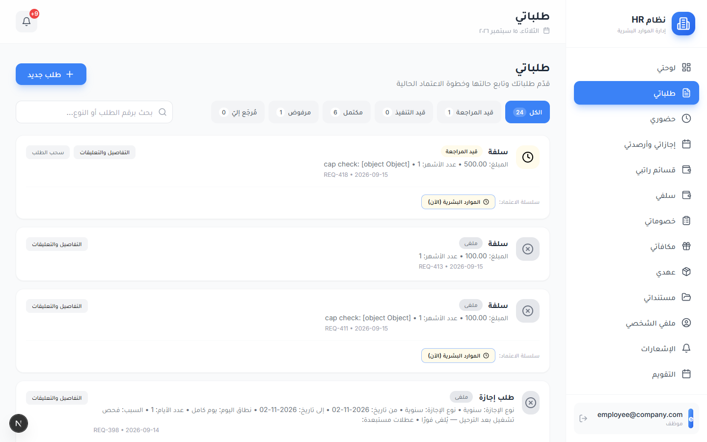
- عنوان الشاشة اللي فوق لسه مكتوب فيه «سياسات الرواتب» في صفحة «معادلات الرواتب»، و«معادلات الرواتب» في صفحة «القيم العامة للخصومات».
- فاضل كلام تقني صغير: «نسخة 1» جنب سقف السلفة، و«المعامل 1 • أساس 30 يومًا» في القسيمة، و«#7» في عنوان اعتماد استثناء الحضور، و«بمجموعة سياسة مختلفة» في شاشة المسير، ورقم الموظف بـ«#» في رسالة رفض الاعتماد لما الحضور يتغير.
- بعد «إلغاء خصم»، الخصم بيختفي من النافذة بدل ما يتكتب جنبه «أُلغي». مش هيتلغي مرتين، بس مش واضح إنه اتلغى.
- مسير الفترة اللي لسه ماخلصتش بيحسب النهارده غياب لو الموظف لسه مابصمش. وفيه موظف عنده غياب قديم متسجل على 21 و22 سبتمبر وبيتحسب عليه. الأحسن تعتمد بعد ما الفترة تخلص وبعد إعادة الحساب.
- قفل خصم التأخير في المعادلة مابيلغيش ساعة التأخير، لأنها بتتحسب نقص ساعات. لو عايزها صفر خالص اقفل «خصم نقص ساعات العمل» كمان.
- أي نوع مكافأة أو خصم جديد لازم تكتب له كود من جوه «خيارات إضافية».
- تغيير ساعات اليوم أو بداية الدورة في معادلة شغالة بيبدأ من الفترة الجاية إلا لو غيّرت التاريخ. أما «طريقة الخصم» فبتتطبق على طول مع إعادة الحساب.
- «إعادة حساب المسير» في مسير متداخل مع مسير تاني لسه ماتعتمدش بترفض أول مرة، وبعدها بتظهر خانة «حفظ رغم التعارض». والمسيرات القديمة اللي اتحسبت قبل كده (من 6 لـ 21) محتاجة إعادة حساب قبل الاعتماد.
- لينكات «بانتظار موافقتي» عند المدير بتفتح على «الكل» مش على «بانتظار اعتمادي».
- حد المرفق في إلغاء الخصم بقى 366 يوم، فصاحب نوع الخصم يقدر يلغي مبلغ كبير من غير مرفق.
- بيانات التجربة لسه موجودة لأن مفيش مسح: المسيرات من 67 لـ 70، والمعادلتين «معادلات تجربة التبسيط أ» و«ب»، والموظفين من SMP-01 لـ SMP-03، وطلب السلفة REQ-418 مستني المراجعة. ومسيرات ومعادلات التجارب التانية اتلغت أو اتأرشفت.
