# موجة الرواتب — 16 سبتمبر 2026

ده تنفيذ قراراتك بعد تقرير 15 سبتمبر. **مفيش محرك جديد ولا مفهوم جديد**: حاجات اتشالت، وحاجات رجعت مكانها الصح، وحواجز قديمة اتصلحت.
بيانات التجربة القديمة كلها (SMP-01..03، GUIDE-01/02، المسيرات 67–74) لسه شغالة وبتتفتح بأرقامها.

---

## 1) قرارك بقى إيه على الشاشة

| القرار | اللي بقى فعلاً |
|---|---|
| **أ1 — الشرائح جوه المعادلة** | شرائح التأخير بقت جوه «معادلات الرواتب» نفسها، كل معادلة وشرايحها. مفيش شهر بتكتبه. الشاشة القديمة اتقفلت وبتوديك على المعادلات. كل الـ14 معادلة اتربطت بالجدول اللي مسيراتها كانت بتستعمله فعلاً، فمفيش رقم اتغير. |
| **أ2 — بداية الاستحقاق** | خانة «بداية استحقاق الراتب» في شاشة الموظف، بتتملي لوحدها بتاريخ التعيين. الأيام اللي قبلها مابتتدفعش ومابتتخصمش، والقسمة بقت على **أيام الفترة الحقيقية** (31 أو 28) مش 30 ثابت. |
| **أ3 — إجازة بدون مرتب** | بقت بأيام التقويم في الطلب والرصيد والخصم — رقم واحد في التلاتة. الإجازة المدفوعة فاضلة بأيام العمل زي ما هي. |
| **أ4 — مفيش سقف ولا تداخل** | سقف الخصم اليومي وترتيب «التأخير ياكل النقص» اتشالوا من المحرك ومن «سياسات النظام» ومن القسيمة. كل خصم بيتحسب كامل. ترحيل الزيادة للشهر الجاي زي ما هو. |
| **أ5 / أ6** | **مفيش تغيير** (اتأكدنا بالاختبار): سعر الإضافي في الإعدادات العامة ومانزلش جوه المعادلات، والسماحية حد مش خصم من الوقت. |
| **أ7 — المستثنى من البصمة** | مفيش عليه خصم خالص ومفيش إضافي. الإجازة بدون مرتب مابقتش تتخصم منه، وخيارات التجاوز الفردية اتشالت من الشاشة ومن الـAPI عشان الاستثناء يبقى معناه حاجة واحدة. |
| **ب1 — السلفة** | إعداداتها رقمين جنب باقي الإعدادات: كام مرة في الشهر، والحد الأقصى (مبلغ ثابت أو نسبة). فورم الموظف بيقفل «إرسال» **قبل** ما يبعت ويقول السبب بالعربي. |
| **ب2 — وقت فتح الطلب** | «من يوم… لـ يوم…» زي ما هي وجنبها مفتاح «اقفل الطلب دلوقتي». القروض بشهورها ماتلمستش خالص. |
| **ب3 — خصم ومكافأة كطلب** | بقى ليهم كارتين في «طلب جديد» جوه المجموعة المالية، والكارت بيفتح الشاشة جاهزة على الإنشاء. **نفس المحرك ونفس الدفتر** — الباب بس هو اللي اتغير. |
| **ب4 — مين يقدّم** | كل نوع ليه «مين يشوفه». دلوقتي الخصم والمكافأة لمدير النظام والموارد البشرية ومدير الفرع بس، والسلفة للكل. والقفل محترم كمان لو حد بعت مباشرة من غير الشاشة. |
| **ب5 — شيل خصم** | فاضل ضغطة واحدة: تأكيد جوه نفس النافذة، وخانة سبب **اختيارية**، والصف بيفضل باين مكتوب جنبه «أُلغي»، والقسيمة سطر واحد. |
| **ج1 — الموارد البشرية** | الطلب اللي بتقدمه نيابة بيعدّي فوراً من غير دورة، وتقدر تتصرف في أي طلب واقف. حاجة واحدة بس زوّدناها: **ماحدش يعتمد طلب نفسه**، وطلبات الفلوس وتغيير الوظيفة اللي ترفعها نيابة بتفضل ماشية بدورتها. |
| **ج2 — المرونة** | اتشالت خالص من شاشة الموظف. الموظف مرن لأن ورديته مرنة وخلاص. |
| **ج3 — الأذونات** | كل نوع بياخد رقمين: «كام مرة في الشهر» (بقت رفض فعلي قبل الإرسال) و«أطول إذن». الباقي نزل تحت «خيارات إضافية». الفاضي أو الصفر = بلا حد. |
| **ج4 — اعتماد المسير** | **مفيش تغيير**: اللي حسب مايعتمدش، ورخصة الشركة الصغيرة مقفولة. |
| **هـ — خفة الشاشات** | فورم الخصم والمكافأة اتشال منه تاريخ الواقعة ومرجع المستند وعدد الأقساط وصندوق الحدود، والمعاينة بقت جوه زرار الإرسال. الحقول الإجبارية من غير سبب (ومنها البدلات) بقت اختيارية. الكلام التقني بقى عربي عادي. |

---

## 2) إزاي تشتغل

### السلفة
1. من **«سياسات النظام» ← «سقف السلفة»**: اكتب كام مرة في الشهر، والحد الأقصى مبلغ ثابت ولا نسبة من المرتب. جنبها أيام فتح الطلب ومفتاح «اقفل الطلب دلوقتي».
2. **الموظف** بيطلب من «سلفي» وبيشوف سقفه قبل ما يبعت، ولو كتب أكتر زرار الإرسال بيتقفل.
3. **الموارد البشرية** بترفع من «السلف والقروض» ← «طلب سلفة جديد»: تختار الموظف الأول، والسقف اللي بيتفحص سقفه **هو**، والسلفة بتتقيد **باسمه**، وشهر أول قسط مكتوب في الطلب.

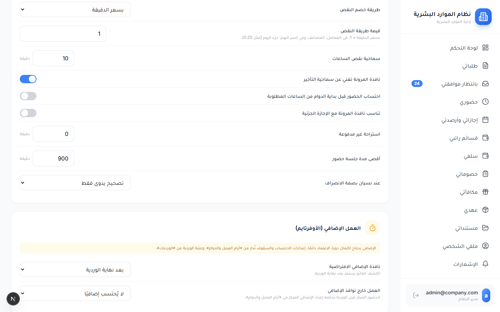 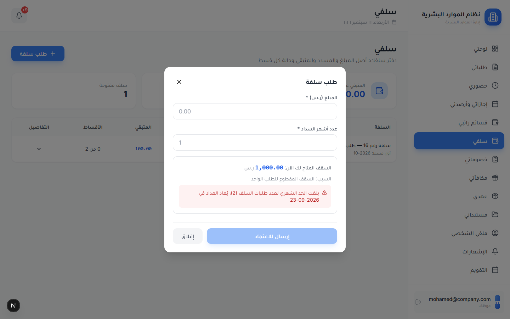 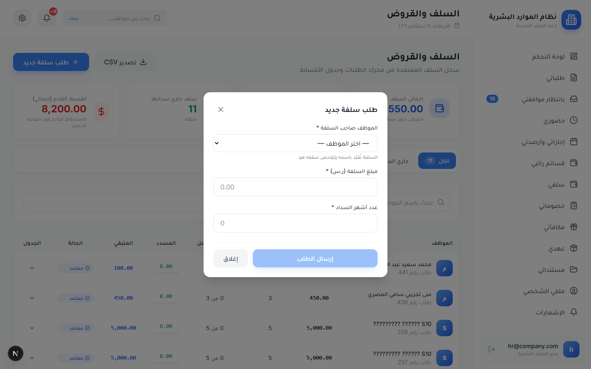

### الخصم والمكافأة
1. من **«طلب جديد» ← المجموعة المالية** هتلاقي كارت «خصم» وكارت «مكافأة» (والموظف العادي مش شايفهم).
2. الكارت بيفتحلك الشاشة جاهزة على تبويب الإنشاء.
3. اختار موظف أو فريق أو قسم أو فرع، اكتب مبلغ أو نسبة، اختار شهر المسير، وابعت. الموافقة زي ما هي، وبعد آخر اعتماد بينزل في مسير شهره لما تعيد الحساب. وبيبان في «طلباتي» و«بانتظار موافقتي» زي أي طلب.
4. **مين يشوفهم** بيتظبط من «أنواع الطلبات» ← «مين يشوفه».

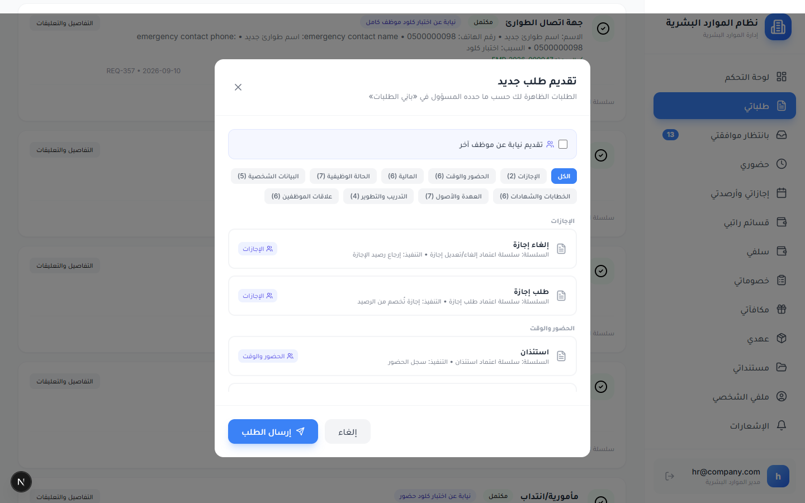 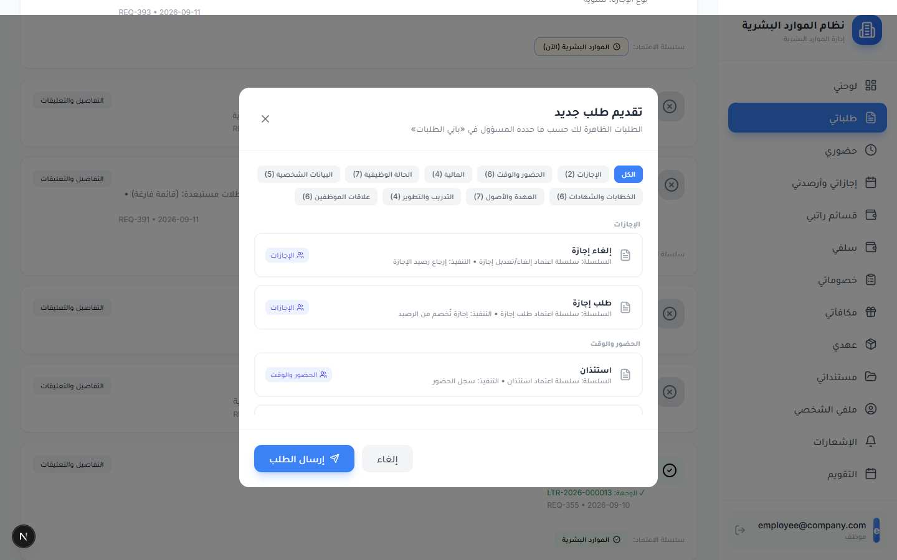 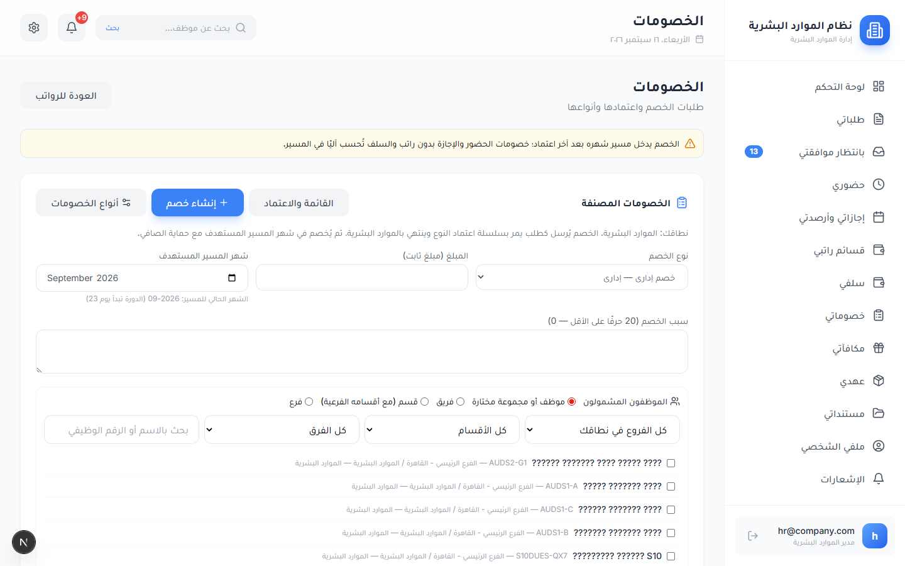 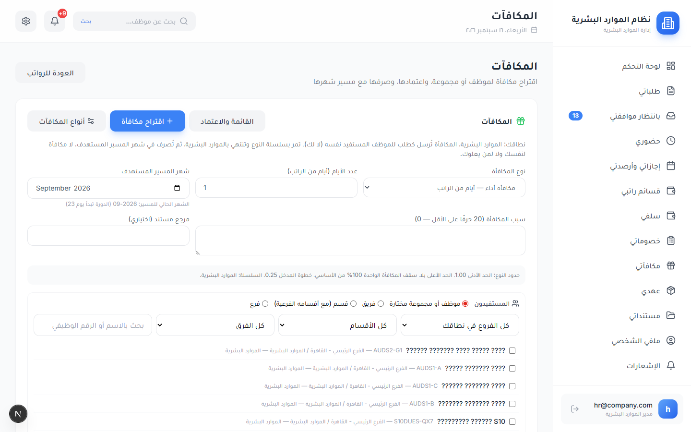 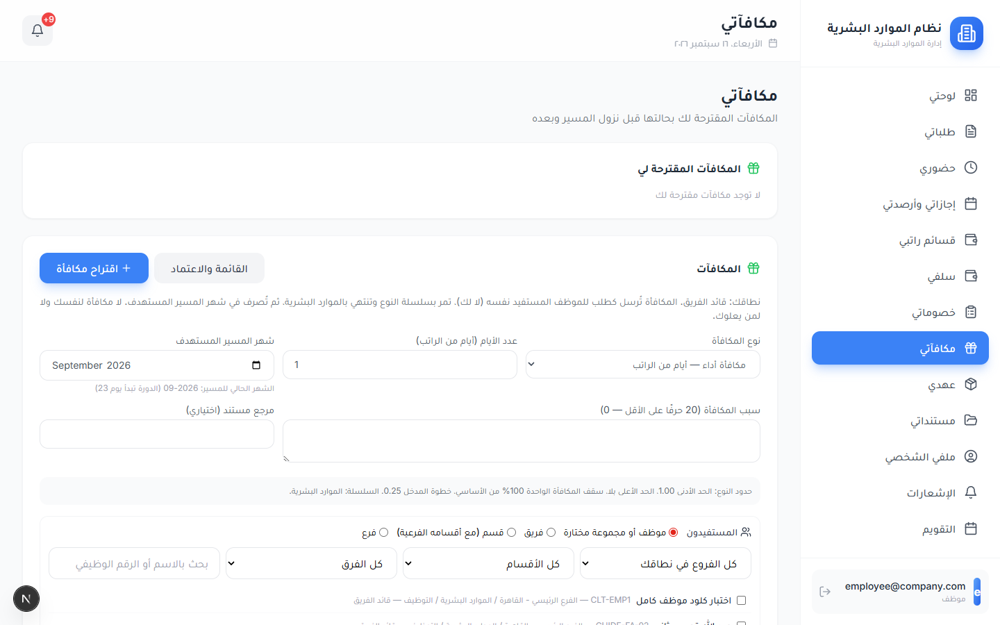

### شرائح المعادلة
1. من **«معادلات الرواتب»** افتح المعادلة ← لوحة **«طريقة الخصم»**.
2. جوه «شرائح خصم التأخير» اكتب الشرايح (من دقيقة لـ دقيقة، ربع يوم ولا مضاعف). الحفظ بيربطها بالمعادلة دي وحدها، ومفيش شهر بتكتبه.
3. لو سيبت الشرايح فاضية الشاشة بتقولك «لا توجد شرائح الآن: كل دقيقة تأخير تُخصم بسعر الدقيقة». والمعادلة الجديدة بتاخد آخر شرايح مفعّلة لوحدها.

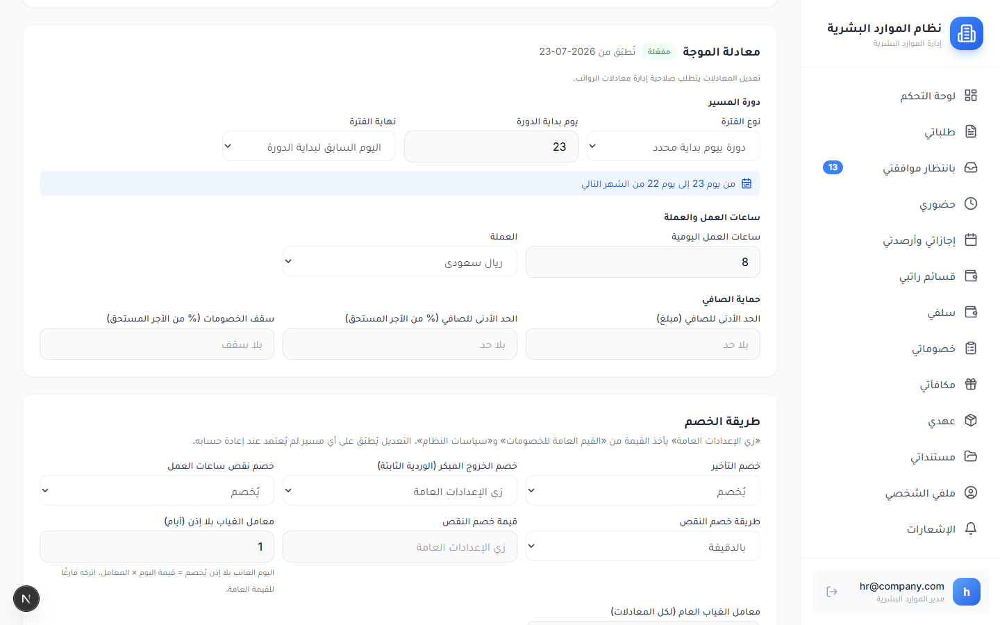 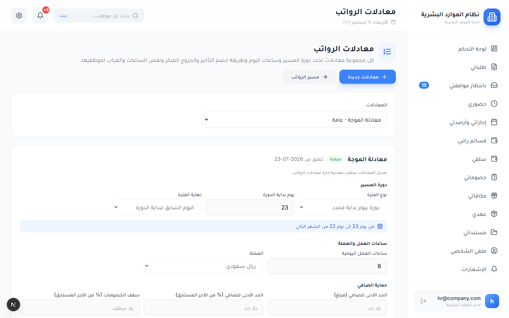

### بداية استحقاق الراتب
1. في **«إضافة موظف» ← «البيانات الوظيفية»**: أول ما تكتب تاريخ التعيين الخانة بتتملي بنفس التاريخ.
2. غيّرها لو الموظف مستحق من يوم تاني، والأيام اللي قبلها مابتتدفعش ومابتتخصمش.
3. مفيش أي خانة مرونة هنا — المرونة من الوردية.

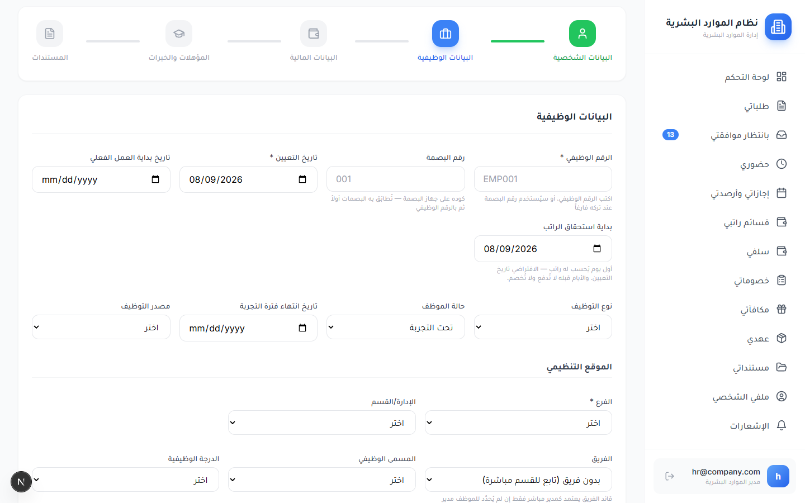 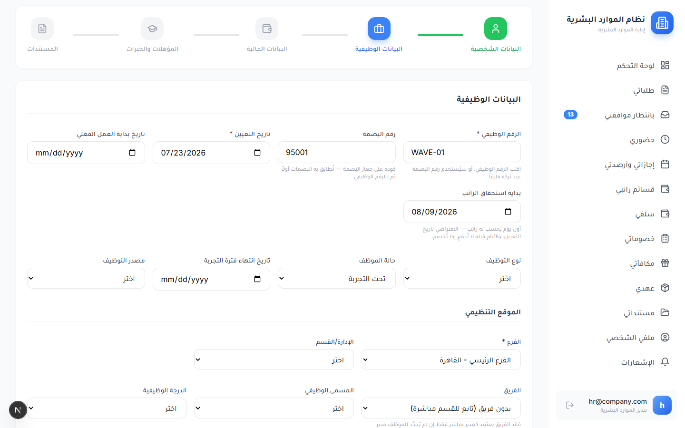 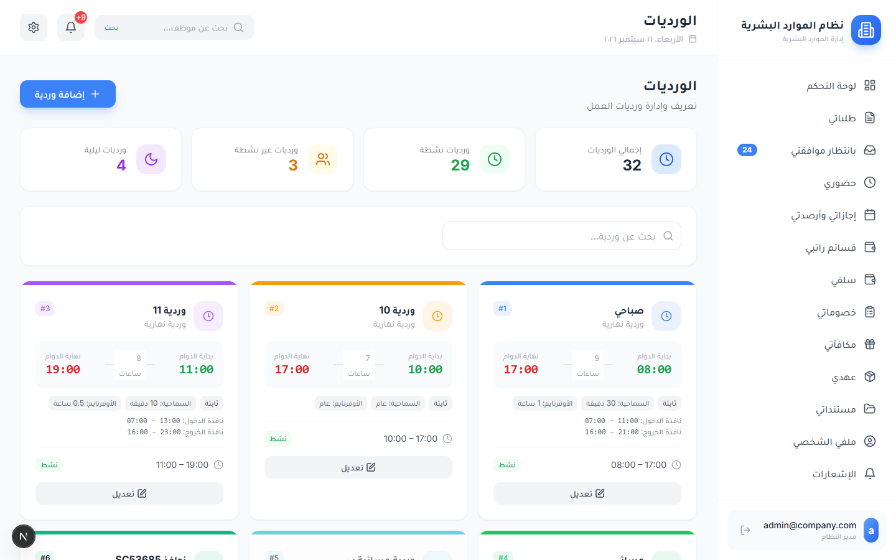

---

## 3) أرقام التجربة

موظفين جداد: **WAVE-01** (مرتب 9,300، مستحق من 9 أغسطس) و**WAVE-02** (مرتب 7,200، مستثنى من البصمة). فترة المسير من 23 يوليو لـ 22 أغسطس = **31 يوم**.

| المسير | الموظف | المستحق | الخصومات | الصافي |
|---|---|---|---|---|
| 77 (أغسطس — معتمد) | WAVE-01 | 4,200 | 1,852.25 | **2,347.75** |
| 77 | WAVE-02 | 7,200 | 0 | **7,200** |
| 78 (سبتمبر — محسوب) | WAVE-01 | 9,300 | 5,890 | **3,410** |

- **المستحق 4,200:** 9,300 ÷ 31 يوم × 14 يوم (من 9 لـ 22 أغسطس). التأخير والنقص والـ9 أيام غياب اللي قبل 9 أغسطس مااتخصموش خالص.
- **تأخير 45 دقيقة يوم 10/8 = 77.50:** شريحة ربع يوم × سعر اليوم 310.
- **نقص ساعة يوم 11/8 = 38.75:** 310 ÷ 8 ساعات.
- **غياب يوم 12/8 = 310:** يوم × معامل 1.
- **إجازة بدون مرتب من 13 لـ 16 أغسطس = 1,240:** 4 أيام تقويم والجمعة والسبت جوّاهم — نفس الرقم في الطلب والرصيد والخصم.
- **خصم 186:** طلب خصم 2% من المرتب، اتقدّم واتوافق عليه ونزل في مسير شهره لوحده.
- **WAVE-02 أخد 7,200 كاملين:** مستثنى من البصمة فمفيش خصم ولا إضافي.
- **مسير 78 فيه 19 يوم غياب** لأن فترته (23/8–22/9) لسه ماخلصتش وإحنا في 16 سبتمبر — الرقم ده بيتظبط أول ما تعيد الحساب بعد ما الفترة تقفل. وعليه جرّبنا «إلغاء الخصم» فالقسيمة بقت تقول «أُلغي خصم إنتاجية بمبلغ 186.00».

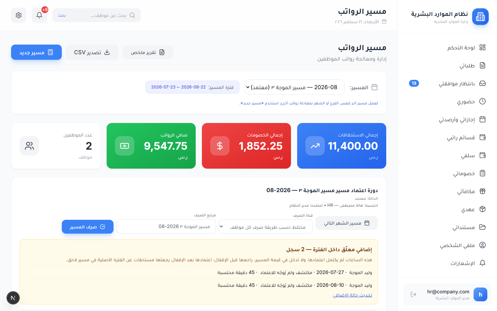
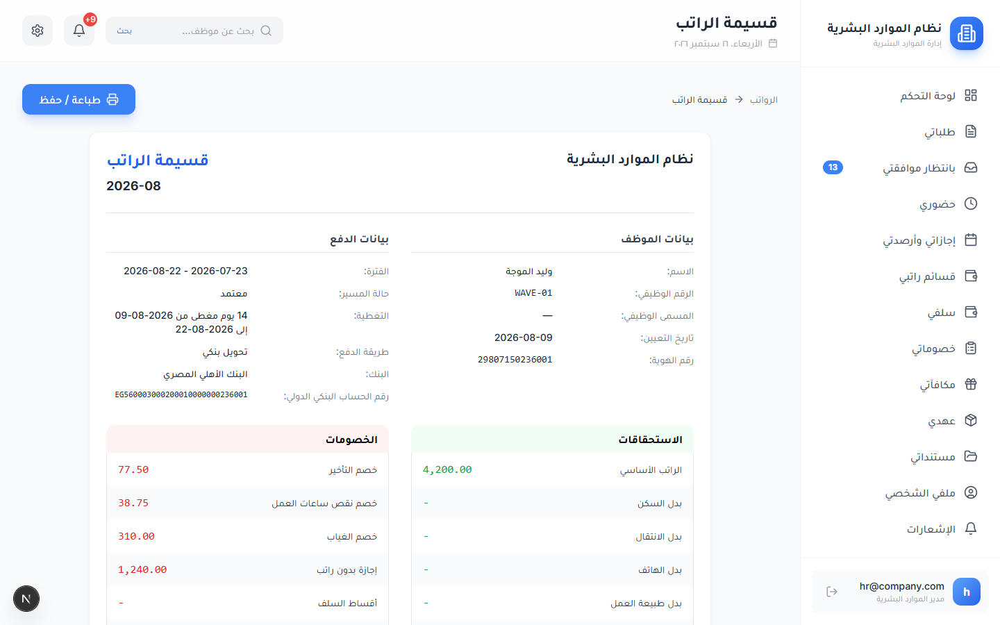 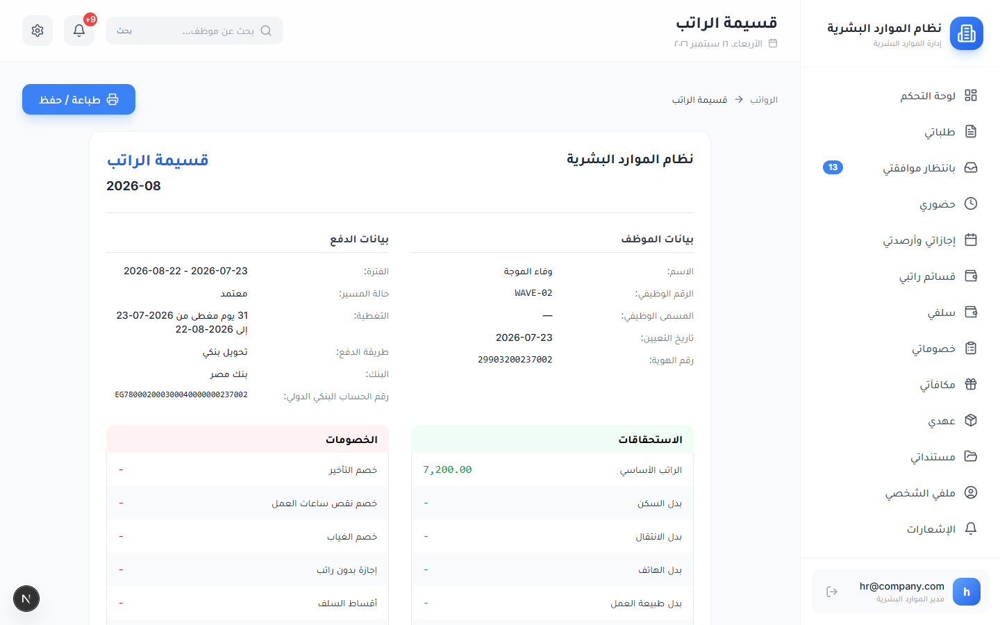 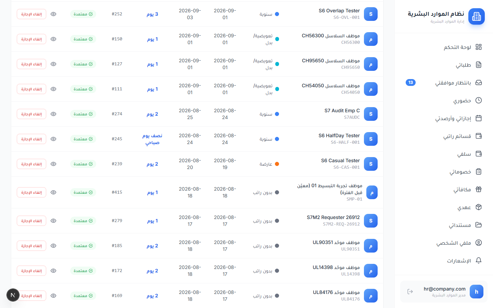 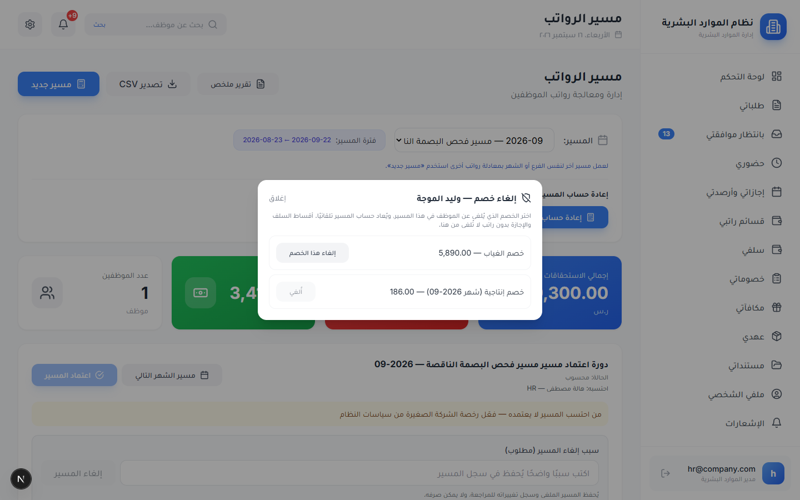 

---

## 4) اللي اتصلح من مشاكل التقرير القديم

- **البصمة الناقصة** بقت تبان وقت الحساب مش وقت ما الاعتماد يترفض.
- **الغياب الأقدم من نافذة اللحاق** بيتسجّل ويبان أول ما تفتح الكشف الشهري (وبيملا الناقص بس، مش بيعيد حساب الشهر كله).
- **الإضافي على يوم قديم** بقى يقول سببه: «مضى على اليوم 37 يومًا وحد الأثر الرجعي 30 يومًا».
- **صلاحية الرصيد الافتتاحي** مابقتش تزحف لسنة جديدة لما تعدّل عدد الأيام.
- **مسؤول الفرع** مابقاش يملا فورم الوردية ويترفض في الآخر — السبب مكتوب قبل ما يبدأ.
- **القسيمة** بتعرض الهوية والبنك والآيبان.
- **«طلباتي»** بقت تبان لمن قدّم بالنيابة، موسومة «نيابة عن (الاسم)».
- **قايمة المسيرات** من غير عكس ولا تكميلي ولا ملغي وبتفتح على مسير حقيقي، و`?run=ID` لسه بيفتح أي مسير قديم. ووقتها لمسؤول الفرع كان **3.4 ثانية** بقى **أقل من ربع ثانية**.
- **«[object Object]»** والأكواد الإنجليزية اختفوا، والعناوين بقت زي القايمة الجانبية بالظبط (في الهيدر وفي جسم الشاشة)، و«المستخدم #12» بقى اسم، و«فروع: غير معروف» اتشالت، وحذف المؤهل بقى بتأكيد، وصورة الموظف الناقصة مابقتش تتطلب مع كل تحميل.
- **مهمة التهيئة 145** على CLT-ATT1 اتمسحت لوحدها، وباقي مهامه الـ8 زي ما هي.

 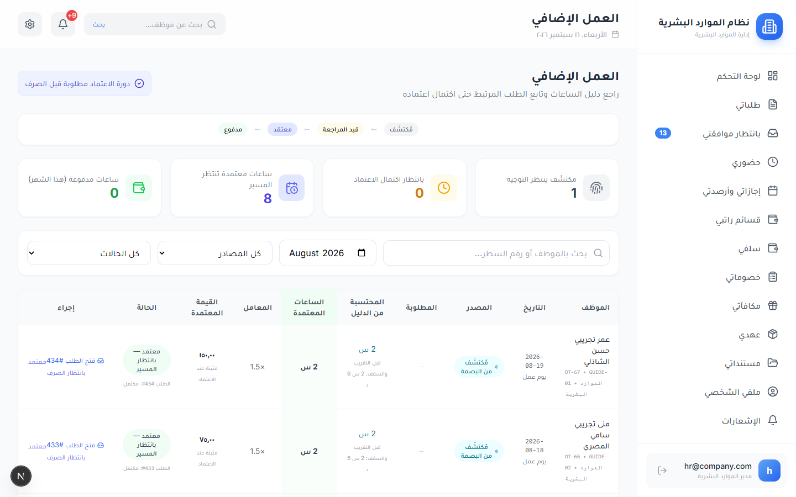 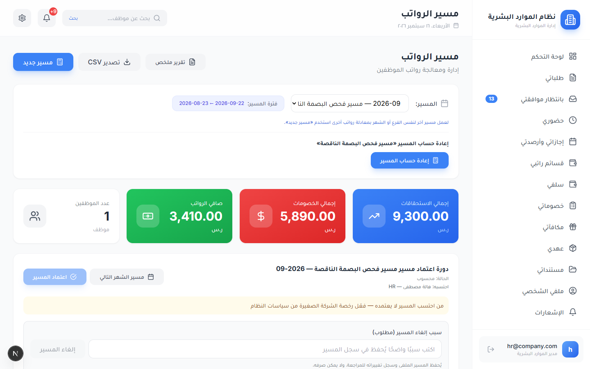 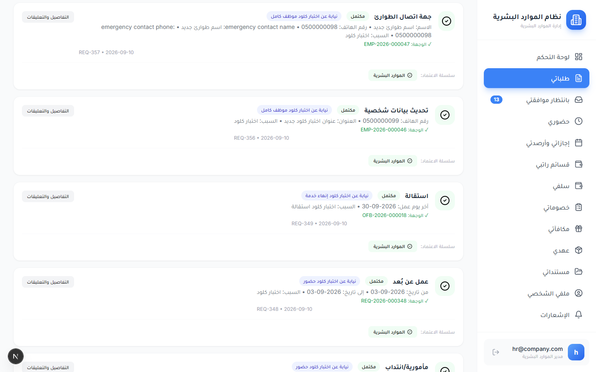 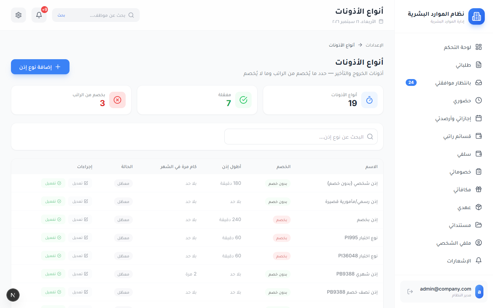 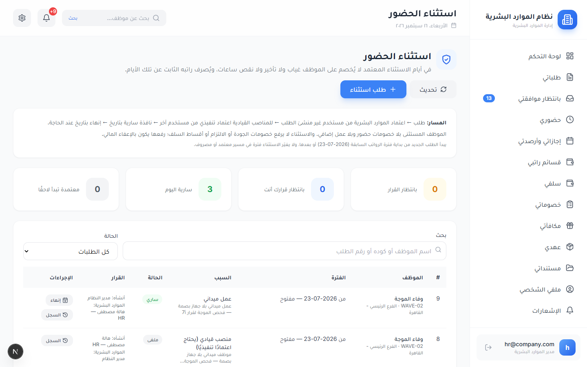

---

## 5) لسه مفتوح — عايزين كلمتك

1. **سعر اليوم مقابل التناسب (أهم بند).** المستحق بقى بيتقسم على أيام الفترة (يوم WAVE-01 = 300)، لكن سعر يوم الخصم لسه المرتب ÷ 30 = 310. يعني يوم الغياب بيتخصم أكتر شوية من قيمة اليوم. سيبناه كده عشان أرقام الغياب والتأخير ماتتحركش في نفس الموجة، وعشان سعر ساعة الإضافي مبني على نفس الأساس. لو عايزهم رقم واحد قولنا — ده بيغيّر خصومات **كل** الموظفين (يوم الغياب في شهر 31 يوم ينزل من 310 لـ 300، وفي فبراير يطلع).
2. **قادة الفرق.** الخصم والمكافأة دلوقتي لمدير النظام والموارد البشرية ومدير الفرع. في ناس دورهم «موظف» وبيرفعوا لفريقهم — دول مش هيشوفوا الكارتين لحد ما تضيفهم من «أنواع الطلبات» (سطر واحد، من غير كود).
3. **سلفة من التجربة الحية لسه قايمة:** 100 جنيه على الموظف رقم 19 بقسطين 50 في أكتوبر ونوفمبر. تتسوّى من شاشة السلف أو تقبلها — الحذف ممنوع في الموجة دي.
4. **مسيرين فاضيين** في القايمة (75 و76 «مسير الموجة») من غير أي موظف.
5. **المسيرات 69 و70 و73 و74** لسه بأرقامها القديمة؛ أول إعادة حساب هتاخد قرارات أ2 وأ4. نعيد حسابهم دلوقتي ولا تفتحهم بنفسك؟
6. **الإذن:** بعد ما «كام مرة في الشهر» بقت رفض فعلي، نسيب «الدقايق المجانية» و«نسبة الخصم» تحت «خيارات إضافية» ولا نشيلهم؟
7. **حاجتين صغيرين:** مهمة 145 اتمسحت من قاعدة النهارده بس والبيان متسجّل في `docs/migrations/payroll/20260916_037_onboarding_task_145_cleanup.md` (المُرحّل بيمنع الحذف)، فقاعدة جديدة من الترحيلات هترجّعها. واختبار واحد أحمر (`payroll-run-definition` خطوة 17) لسه متوقّع القسمة على 30 القديمة — التوقّع هو اللي محتاج تحديث مش الحساب.
